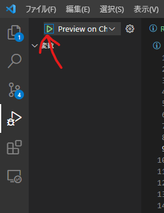
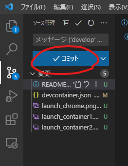
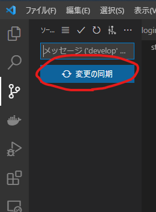
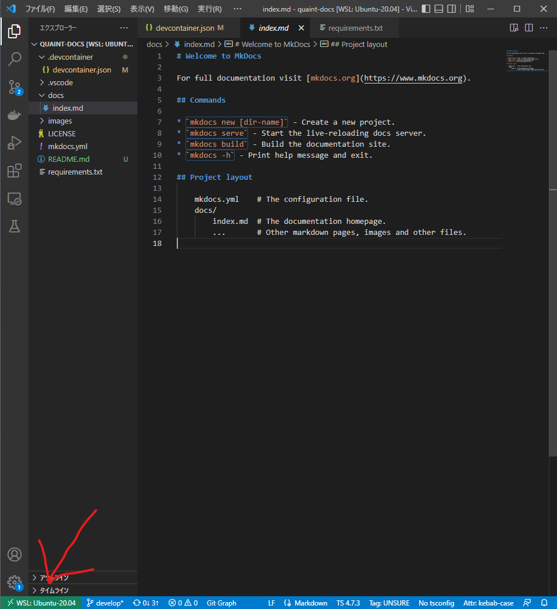
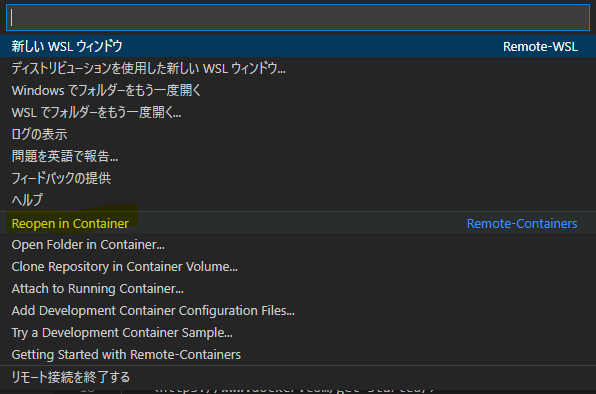

# quaint-docs
星陵祭オンライン整理券システム「QUAINT」のドキュメント
## ドキュメントの書き方
- /docs フォルダの中に、~~~.mdファイルを作成する
- マークダウン記法で内容を書く([マークダウン記法](https://qiita.com/oreo/items/82183bfbaac69971917f))
- /docs をフォルダ分けするとドキュメントページも階層分けされる
## ドキュメントのプレビュー
VSCodeの「実行」ボタンを押す(Google Chromeで開く)

## ドキュメントの公開
1. VSCodeのGitタブからcommit(コミットメッセージは変更内容をわかりやすく書く)
    
2. 「変更を同期」
    
3. GitHub Actionsを組んであるので自動でbuildされて、公開される
    URL: <https://hibiya-itchief.github.io/quaint-docs/>
## Dockerコンテナへの入り方(作業前に毎回必要)
1. VSCode左下のリモート接続ボタン
    
2. Reopen in Container
   
## 環境セットアップ(初回1回だけ必要)
1. ### GitHubのアカウント作成
    <https://github.com/signup>
2. ### VisualStudio Codeのインストール
    ↓リンクを参照して各環境にあったものをインストール
   <https://code.visualstudio.com/download>
3. ### Gitのインストール
    - Macを使用している場合はデフォルトでインストール済み
    - Windowsを使用している場合は↓などを参考にインストール
      - https://zenn.dev/longbridge/articles/5d11bd51665dac
    - ユーザー名とメールアドレスを設定
4. ### dockerのインストール
    ↓リンクから環境にあったものをインストール
    <https://www.docker.com/get-started/>

書いてて思ったけど、これを初心者にいきなりやらせるのは酷だよね。学校で直接教えるか、他の方法探します。

## 謝辞
このリポのcloneですほぼ。
https://qiita.com/hitsumabushi845/items/e5e9b7e3daa1cb2e4a1b