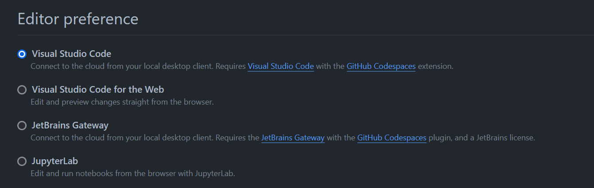
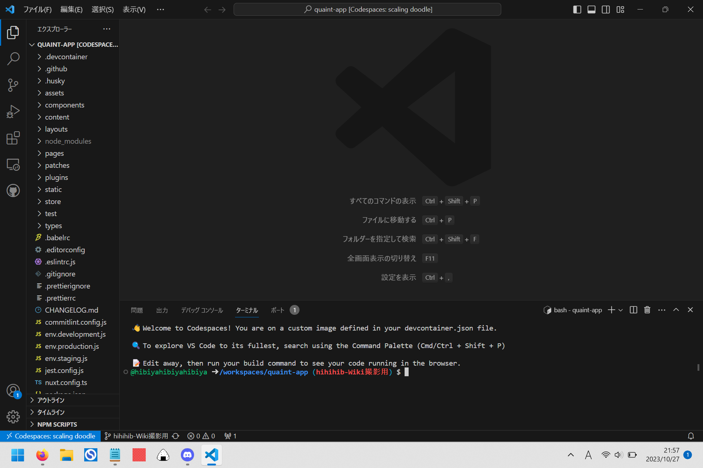
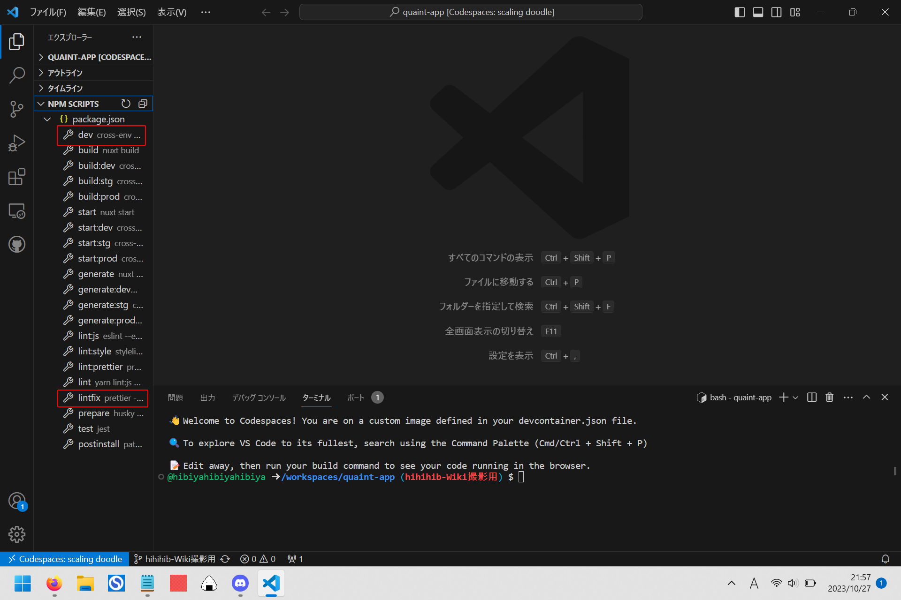
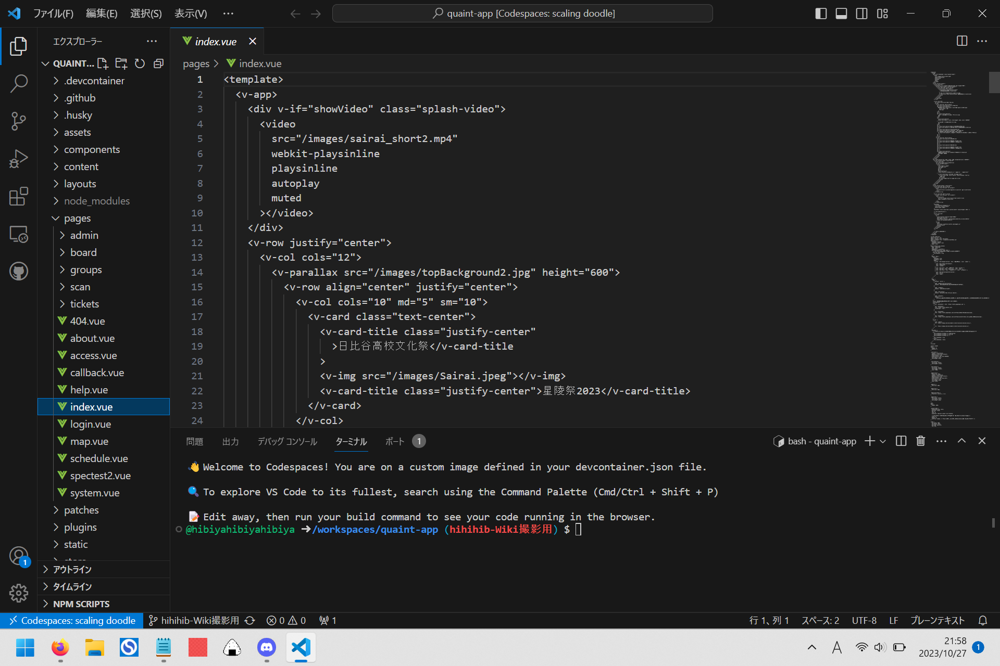
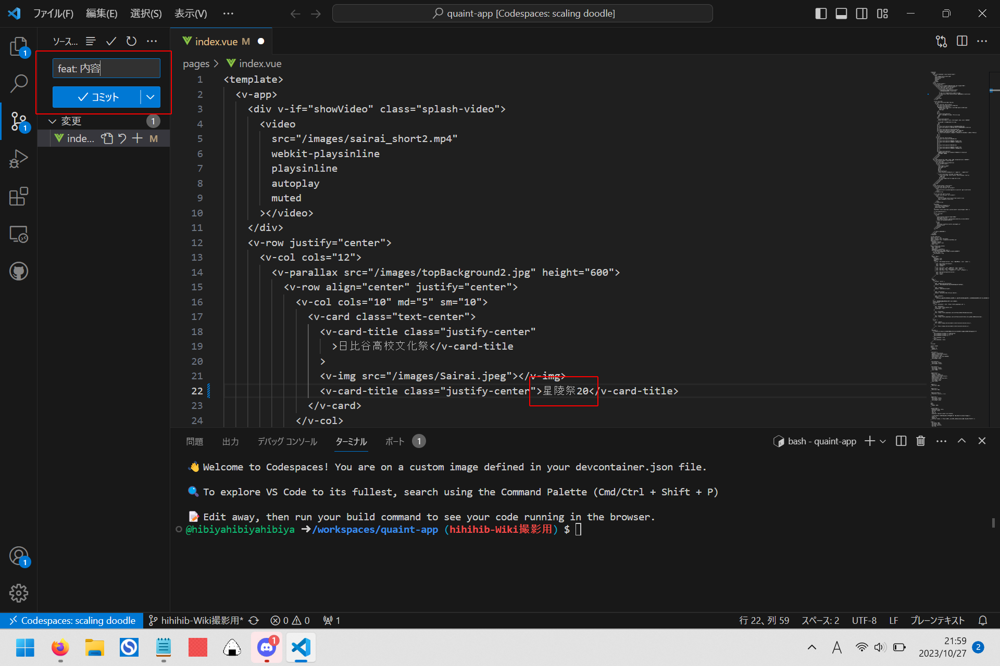
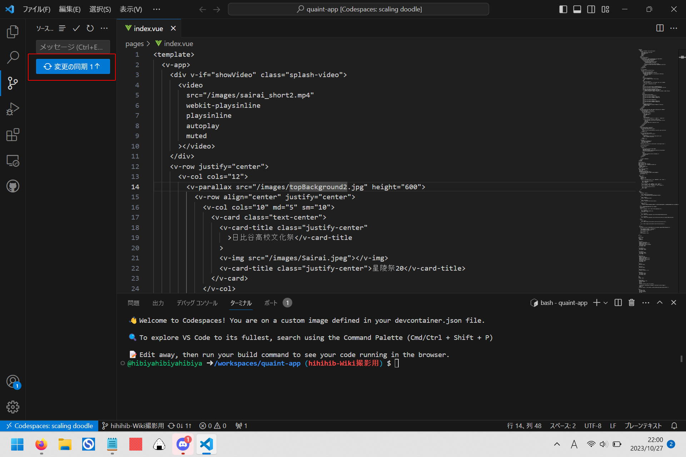
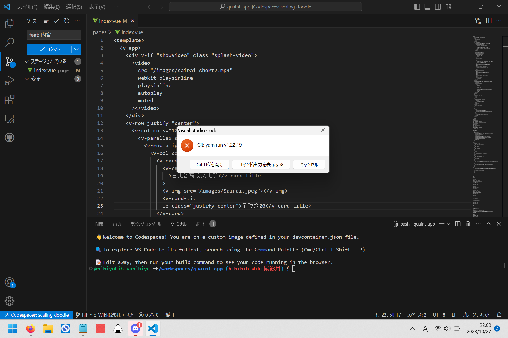
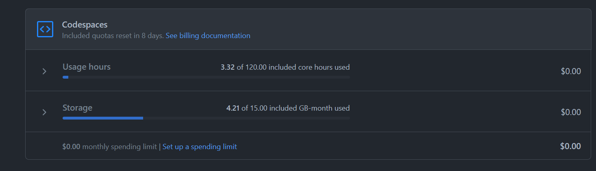

# Codespace

## GitHub Codespacesとは

> 分かりやすく言うと、タブレットやPCなどのクライアントにブラウザさえあれば、クリック1つで開発環境が起動し、すぐに開発作業に入ることができるというサービスです。  
> [GitHub Codespacesで手軽に始めるソフトウェア開発](https://and-engineer.com/articles/YvGkmxAAACEAaaQu)より

ふつうVSCodeで開きます。

  

## デスクトップ版で開く方法

1.デスクトップ版の VSCode をインストールする。  
2.GitHub の自分のアカウントの Settings 内の [Codespaces](https://github.com/settings/codespaces) を開く  
3.下画像のように Editor Preference の項を Visual Studio Code に変える  

初期設定のブラウザ版で開発を行うのはあまりおすすめできません。  
その違いについては【工事中】

ただし、デスクトップ版ではREADME.mdが初期表示されないことには注意です。

  

## Codespaceの使い方(フロントエンド)

Codespaceを開いて少し待つと、このような画面になります。

サイドバーのエクスプローラーでNPM Scriptsを開きます。

 

<h4>dev</h4>

yarn run devの略です。  
詳しくはこちら：[README](https://github.com/hibiya-itchief/quaint-app/tree/develop#readme)

詳しくは【工事中】
<!--
VSCode(アプリ)でquaint-appレポジトリを開発する場合、アドレスバーを127.0.0.1:3000からlocalhost:3000に変更しましょう。  
そうすることでログイン処理ができます。  
[ここ](https://github.com/hibiya-itchief/quaint-docs/pull/21#discussion_r1270231270)で指定されていることを記す。  

また、codespaceのdocsだと4000、これはPlay on chromeってやつ
-->

<h4>lintfix</h4>

Lintfixと呼ばれるツールです。  
詳しくは：[Lintfix](#lintfix)

 

エクスプローラーからファイルを選択し、編集することができます。  
画像のファイルはpages/index.vueです。  
ソースコードに色がついていないことについて詳しくは：[拡張機能](#extensions)

 

編集し、Ctrl + Sを押し保存すると、画像のようにcommitができるようになります。  
commitメッセージについて詳しくは：[Commitlint](#commitlint)

commitは「保存」や「編集」とは異なります。  
頻度としては多すぎず少なすぎず、編集内容的にちょっと一段落ついたというタイミングでcommitするのが良いです。  
具体的な塩梅については、割と感覚的なので省きます。

 

commitし少し待つと、同期するボタンが表示されます。  
押しましょう。これでcommit完了です。  
(この作業がpushとcommitの違い)  

 

もし、commitメッセージがCommitlintに引っかかると、このようなエラーが出ます。

  

## Lintfix
(フロントエンド限定)

Lintfixとは、アプリの実行・作成を行わずに、コードの構造上の(品質に関する)問題を特定して修正することです。  
このツールのことはLinterと言います。フロントエンドではPrettierが使われています。

単にLintやLintチェックというと、それらに問題がないかを確認することを指します。

  

## Commitlint

commitメッセージのLinterです。  
また、同時にLintfixもチェックしてくれます。

実際使っているものに限定して書くと、  
commitメッセージは「feat: 内容」「fix: 内容」という形式で書いてねというものです。  
最初の英単語には他にもdocsなどがありますが、ほぼほぼこの2つのみが使用されています。  
参考：[コミットメッセージの文法](https://zenn.dev/kalubi/articles/27fa889c338cdf#%E3%82%B3%E3%83%9F%E3%83%83%E3%83%88%E3%83%A1%E3%83%83%E3%82%BB%E3%83%BC%E3%82%B8%E3%81%AE%E6%96%87%E6%B3%95)  
[[転載] gitにおけるコミットログ/メッセージ例文集100 ](https://gist.github.com/mono0926/e6ffd032c384ee4c1cef5a2aa4f778d7)  
[Git でコミットする時のルールを言語化してみた](https://pyteyon.hatenablog.com/entry/2020/02/27/092101)  

ただし、ターミナルに以下のように書くと、Commitlintを無視してcommitができます。  
`git commit --no-verify -m "内容"`  
とはいえ、Lintfixの観点から、普通にcommitする方が良いと思います。

## 拡張機能 / Extensions【工事中】
## Nuxt Generate【工事中】
(フロントエンド限定)
[Nuxtについて詳しく](front/nuxt.md)と絡める。  
静的htmlが開けるのも記す.

  

## 使用制限

かなり作業しないと制限されることはありませんが、一応記しておきます.  

GitHub の自分のアカウントのSettings内の Billing and Plans の [Plans and usage](https://github.com/settings/billing/summary) を開き、Codespace の項を探すと、下画像のような画面が見られます。  

上の Usage hours はそのまま、codespaceを利用した時間のこと。  
今月(米時間)の、codespaceの open だった時間の累計のこと。  
ただし、120と書いてあるのは紛らわしい表記で、これは120時間の利用ということではなく、120 core hours 利用したということです。  
我々無料 GitHub ユーザーの場合 codespace は2-coreで実装されるため、実際には60時間で120 core hoursが尽きるという計算になります。  
いろいろ説明を省いていますが、つまり月60時間まで利用できるということです。  
使い終わった codespace は stop して、だらだらと codespace を使わないようにしてください。 

下のStorageは気にしなくても大丈夫です。  
おそらく、stop されている codespace でも容量を食うため制限を設けているということなのでしょうが、いくつも同時に codespace を用意したりしなければこれが尽きることはそうありません。月末になれば Storage で警告されることがあるかもしれませんが、あまり気にしなくてよいと思われます。

この2種については制限が近づいてくると通知してくれます。  
"You used 50% of ~~~" みたいな感じです。  

  

## 【工事中】

yarnについて規定されているファイルの説明.  
huskyについても最低限加筆.
