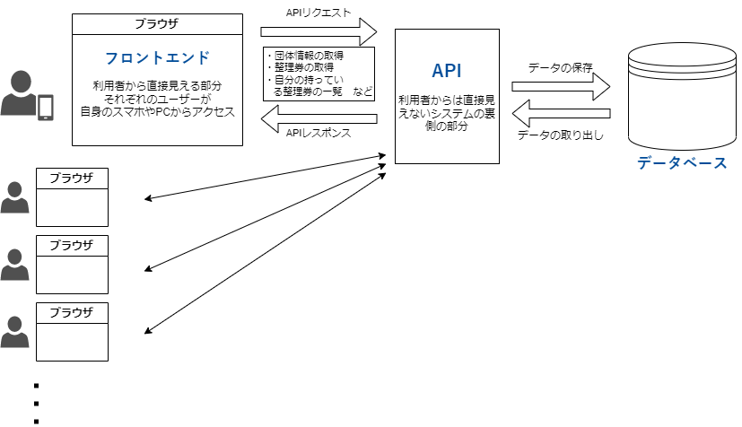

# システムの構成

## 概要

この星陵祭オンライン整理券システムは、以下のように主に 3 つの部分から構成されます。

### フロントエンド
  - 利用者の目に見える、実際に操作する部分です。
  - インターフェイスを提供する。

### API
  - 整理券の取得という機能を提供するためには、残り座席数などを、一元管理する必要があります。
  - それぞれの利用者自身の

### データベース

- 実際にデータが保存される場所です。
- API を通じてデータを操作することができます。

