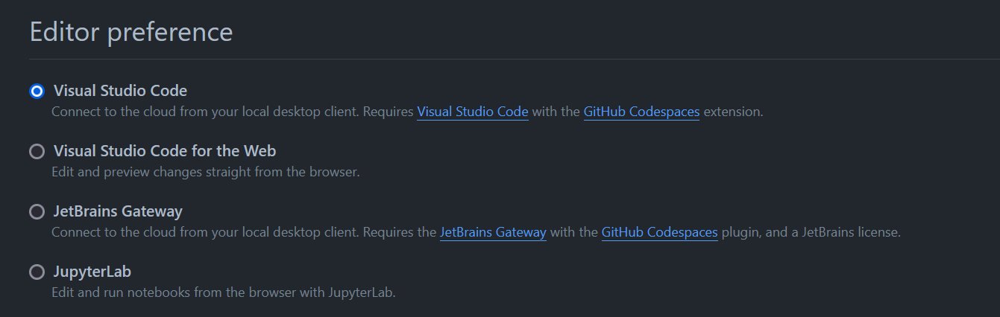

# Codespaceの使い方(暫定)

暫定的に、quaint-appレポジトリのreadme.mdを見ていただく方針で。  

加えてここでは、

- デスクトップ版のVSCodeへの変え方(簡易)
- codespaceの使用制限

について記述します。

VSCode … Visual Studio Code の略
## デスクトップ版のVSCodeを開く方法

1.デスクトップ版の VSCode をインストールする。  
2.GitHub の自分のアカウントの Settings 内の [Codespaces](https://github.com/settings/codespaces) を開く  
3.下画像のように Editor Preference の項を Visual Studio Code に変える  

これだけ。  
なんだけど、拡張機能についてとか、ブラウザ上のVSCodeとの違いとかを記述するのは大変なので暫定的に放置。

## 使用制限

あります。  
ただし、かなり作業しないと引っかかることはない気がするが、一応情報は遺さなければならない。  

GitHub の自分のアカウントのSettings内の Billing and Plans の [Plans and usage](https://github.com/settings/billing/summary) を開き、Codespace の項を探すと、下画像のような画面が見られる。  

上の Usage hours はそのまま、codespaceを利用した時間のこと。  
今月(米時間)の、codespaceの open だった時間の累計のこと。  
ただし、120と書いてあるのは紛らわしい。これは120時間の利用ということではなく、120 core hours 利用したということである。
我々無料 GitHub ユーザーの場合 codespace は2-coreで実装されるため、実際には60時間で120 core hoursが尽きるという計算になる。  
いろいろ説明を省いているが、つまり月60時間まで利用できるというだけ。  
使い終わった codespace は stop して、だらだらと codespace を使わないようにしよう。  

下のStorageは気にしなくても大丈夫。  
おそらく、stop されている codespace でも容量を食うため制限を設けているということなのだろうけど、いくつも同時に codespace を用意したりしなければこれが尽きることはそうない。月末になれば Storage で警告されることがあるかもしれないがあまり気にしなくてよいと思われる。

この2種については制限が近づいてくると通知してくれる。  
"You used 50% of ~~~" みたいな感じだったような気がする。  

## 【工事中】
yarn自動
yarn run dev
nuxt generate
lintfix（prettier）

commitするときのerror:形式、lintfixエラー、など
git commit --no-verify -m "aaa"も一応紹介

nuxtgenerate: コンパイルされたver.
説明むずいな…

また、web editorも？extensionsはないけどね；

