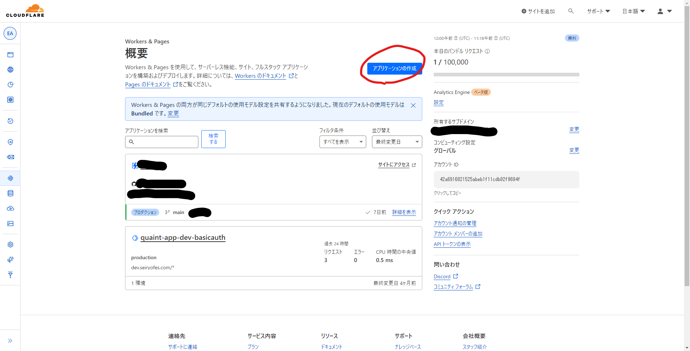
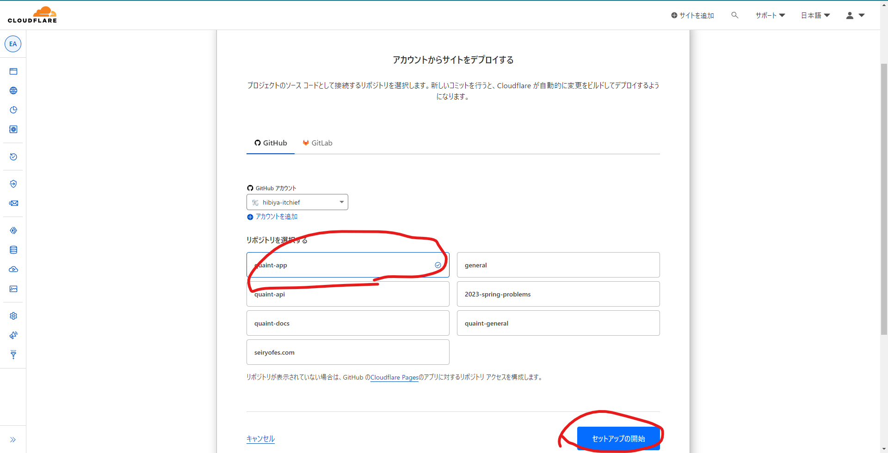
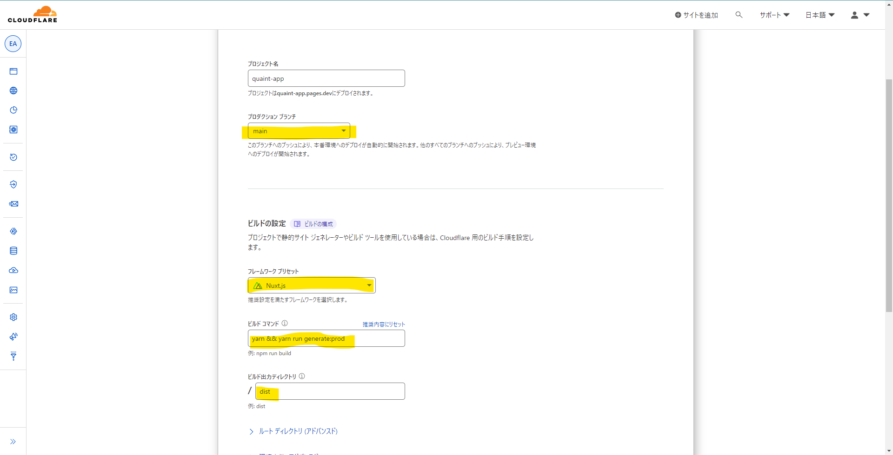
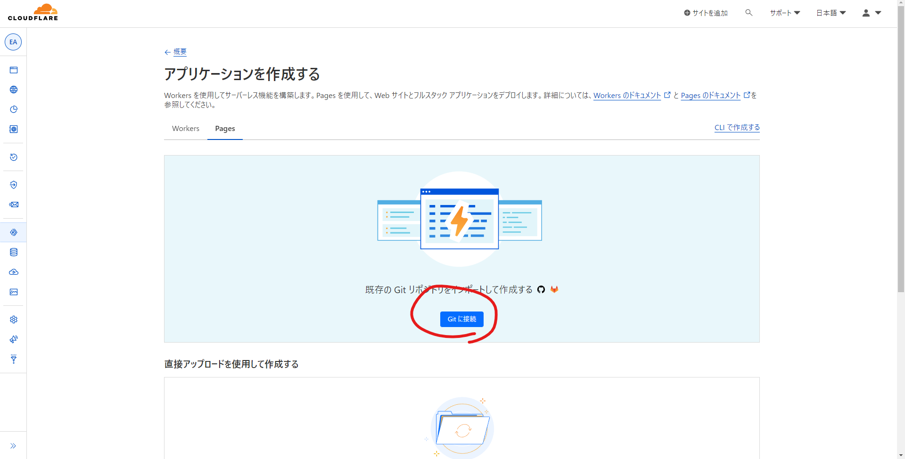
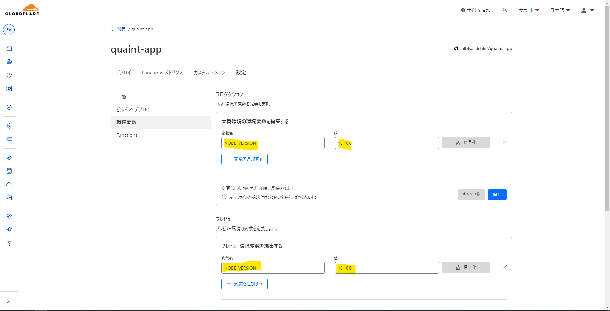

# その他【工事中】

全くの未定.

# フロントエンドのビルドについて
テンプレートにデータを埋め込んでサイトを公開する処理が必要です。  
通常 1 日 1 回  

cloudflare-pages.png

git-repo.png

repo-setting.png

pages-git.png

node-version.png

時系列がバラバラであること、画像が小さくなってしまうことは御宥恕願いたい.

# Vueページに書くべきか悩むこと

## バックエンドとの関係【工事中】
・asyncやaxios含む「バックとの関係」jsonなどもここ、nuxtauthも一応ここ？いや違うかも、ログイン関係はまた別かも、だってazureでリンク指定してるしな、また別につくろ、ああそういえばroleと被る？

## エラーについて【工事中】

エラーについて？  
catch関係、もそうだし、開発環境だけエラー出る話も。というより本番環境だと揉み消される…？  
エラーについてのページ欲しいね；e.g.SyntaxError  

## lintfixについて【工事中】

lintfixについて述べる予定、あまり書く事は無いかも？  
ただ、PRでエラーが出るのでさすがに記述しないわけには、と  
prettier  

