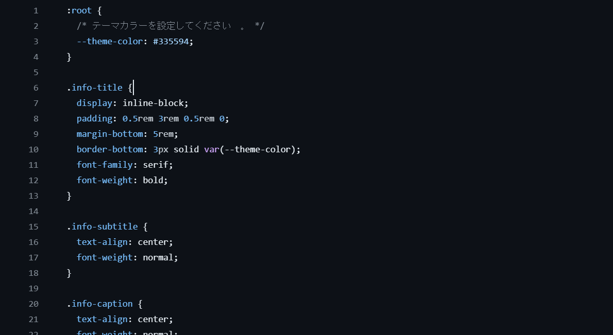
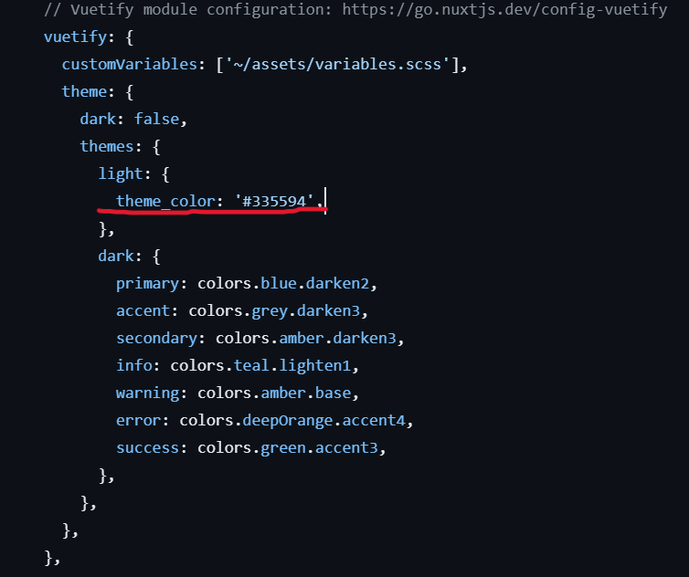
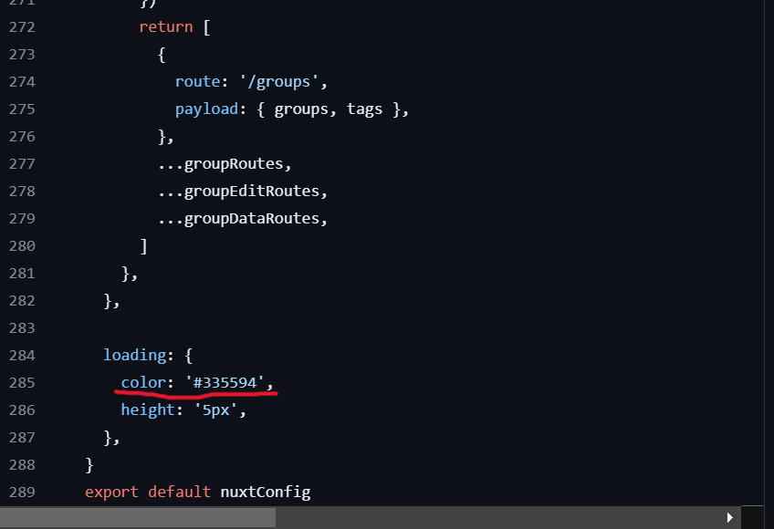

# テーマカラーの設定

サイトのテーマカラーの設定の仕方を書いておきます。

## css の設定の変更

~/assets/css/main.css に主な css の設定がまとめられています。

:root{}にある--theme-color の欄に設定したテーマカラーのカラーコードを入力してください。

## vuetify の設定の変更

nuxt.config.ts にかかれている vuetify の設定を変更します。

vuetify:{
theme:{
themes:{
light:{
theme_color: '設定したいカラーコード'
}
}
}
}

theme_color にテーマカラーとして設定したカラーコードを入力してください。

## ローディングバーのカラーの設定

ローディングバー（ロード中に表示されるページ上部の線）のカラーの設定をするには nuxt.config.ts の設定を変更します。

赤線で示した color の設定にの部分に指定したいカラーのカラーコードを入力してください。
