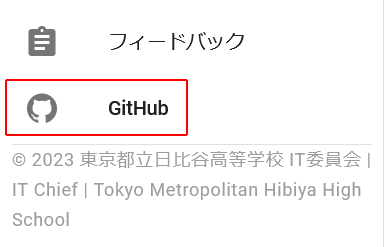

# GitHubの使い方(暫定)

## GitHubとは

> 「GitHub（ギットハブ）」とはプログラムのソースコードを、オンラインで共有・管理するサービスです。  
> [GitHubとは？](https://www.kagoya.jp/howto/it-glossary/develop/github/)より

詳しくはこちら：[GitHubとは？](https://www.kagoya.jp/howto/it-glossary/develop/github/)  
(ただし、我々のSurfaceでは基本的にローカル環境を整備しなくても良いと思います。  
詳しくは【工事中】)

現在動いている星陵祭のサイト seiryofes.com や、現在表示されているこのページも、
GitHub上にソースコードがあります。  

このページでは、そんなGitHubの具体的な使い方について記します。  
(以下、IT委員会のGitHubに入っていることを前提とします。)  

  

## レポジトリ / Repository

「一番大きい分け方のフォルダ」というイメージでよいと思います。  
この中にたくさんのファイルやフォルダが入っています。  

レポジトリ名の横に **`Public`** と書かれている場合、外部の人が中身を見ることができます。  

各レポジトリについては以下の通りです。

<h4>quaint-app</h4>

フロントエンドです。

<h4>quaint-api</h4>

バックエンドAPIです。

<h4>quaint-docs</h4>

星陵祭オンライン整理券Wikiです。  

<h4>general</h4>

唯一privateレポジトリ(非公開のレポジトリ)で、IT委員会内部についての情報などを入れる予定となっています。  

ここでは例として [quaint-app](https://github.com/hibiya-itchief/quaint-app/tree/develop) レポジトリのdevelopブランチを使って説明します。  

赤枠の内容を上から順に説明します。  

一番左の[Code](https://github.com/hibiya-itchief/quaint-app/tree/develop)ではソースコードの一覧が表示されます。  

[Issues](https://github.com/hibiya-itchief/quaint-app/issues)では、このレポジトリ内のissue一覧が表示されます。  
詳しくは：[Issue](#issue)

[Pull requests](https://github.com/hibiya-itchief/quaint-app/pulls)では、レポジトリ内のプルリクエスト一覧が表示されます。  
詳しくは：[Pull request](#pull-request)

次の赤枠は、現在開いているbranchを示しています。  

その右には現在このレポジトリにあるbranchの数が示され、押すとbranch一覧のページに飛びます。    
詳しくは：[ブランチ・コミット / Branch & Commit](#branch-commit)

右端のCodeというのは、codespaceを作るためのボタンです。  
詳しくは：[Codespace](#codespace)  

また、画面外下方には **`README.md`** のプレビューが表示されています。  
詳しくは【工事中】  

次に、[pages/index.vue](https://github.com/hibiya-itchief/quaint-app/blob/develop/pages/index.vue)を例にして、ファイルの編集画面を説明します。  

このように、ソースコードには色が付けられています。  

この画像は閲覧モードとなっています。  
右の鉛筆マークを押すと編集(Edit)モードになれます。  

内容を編集して、commitをします(Ctrl + Sでも可)。  
詳しくは：[Commit](#branch-commit)

ただし、この画面で編集することはまれです。

  

## ブランチ・コミット / Branch & Commit

> ブランチ【branch】  
> 枝。枝分かれしたもの。  
 
GitHubでは、本流を直接変更するとリスクが大きいため、  
内容の全く同じbranch(枝)を作り、そこで編集・動作確認をして、  
本流に変更箇所を結合させるという仕組みとなっています。  

issueを解決するために作ることが多いです。  

branch一覧のページです。  

quaint-appレポジトリの場合、デフォルトのbranchはdevelopとなっていますが、  
それに加えmainブランチも重要なブランチとなっています。  
この2つは直接編集ができないようになっています。  

mainブランチはseiryofes.comの中身にあたります。  
詳しくは【工事中】

developは開発における本流です。  
ほとんどのbranchはdevelopから分流され、developにマージされます。  
developをmainにマージすることで、seiryofes.comの内容が更新され、最新版になるということです。  

Active branchesは３か月以内にcommitがあったbranchで、  
Stale branchesはそれより古いもののことです。

branchを作る際は、名前と、源流を指定されます。  
ふつう源流はdevelopでよいと思います(ふつう変更箇所をdevelopに結合するため)。  
私[@hibiyahibiyahibiya](https://github.com/orgs/hibiya-itchief/people/hibiyahibiyahibiya)は、ブランチ名を基本 **`#(issueの番号)-(内容)`** としています。  

また、issueの方からもbranchをつくることができます。  

  
この赤枠部分を押します。  

そうすると、このように最初から  
 **`(issueの番号)-(issueの題名)`**  
という名前でつくることができます。  

また、先述のファイル編集画面で編集後、右上の「Commit changes...」というボタンを押すか「Ctrl+S」を押すと、**Commit**ができます。  
(ファイルの内容がひとつも変わっていないと、押しても出てきません)  

Commitとは、branch内で編集内容を更新することです。  

commit名にはどのような変更を行ったのかを書いておきます。  
また、commitは「編集」とは違い、軌跡を残すというイメージの方がよいです。  

??? note "詳しく"
    
    「編集」のつもりで、試行錯誤を全てcommitで行っていたときの画像です。  
    これは正しいcommitのあり方とは違いますので注意してください。  

代わりに、後に記述する[Codespace](#codespace)内か[Web Editor](#web-editor)内で編集を行いましょう。  

また、mainブランチ・developブランチではcommitはできず、代わりに「 *Propose changes* 」となります。  
この両branchを編集したいなら、新しくbranchを作って、そこでcommitしてマージしてくださいということです。  

また、commitと同じような言葉にpushという言葉があります。  
GitHubのみを使うのであればその違いは意識しなくて大丈夫です。

  

## Issue

Issueとは、いわゆるタスク一覧、To Doリストのことです。 
修正点や追加したい要素を記入します。 

暫定的に、詳しくはこちら：[便利機能Issueとその作成方法](https://tonari-it.com/github-issue/)

<!--
[issue一覧](https://github.com/hibiya-itchief/quaint-app/issues)のページでは、 
右上のNew Issueで新しくissueを作ることができます。 
また、**Open**には現在あるissue、**Closed**にはすでに解決したissueが並んでいます。 

issueを見る画面です（再掲、赤枠を追加）。

一番上の赤枠のAssigneesは、誰が問題を担当するのかを分かりやすくするための機能です。 
この画像のissueは **`@hibiyahibiyahibiya`** が担当するということです。 
また、誰もいないときには *assign yourself* というテキストがあるので、そちらを押すと自分自身をアサインできます。 

その下のLabelsでは、issueの種類を示すことができます。 
たとえば **`Type: Bug Fix`** を選択すれば、このissueはバグを直したいというissueであることが判りやすくなります。 

下のDevelopmentは[既に説明した](#branch--commit)通りです。 
 

プルリクエストで問題が解決するなどしたときには、issueをClosedにしてください。 

-->

  

## Pull request

プルリクエストとは、本流とbranchの間の変更箇所を結合して本流の一部にするための機能のことです。  
(以下、結合することをマージと言う)  
正確には、マージしたいというお願いのことです。  
長いのでPRと略すこともあります。  

quaint-appレポジトリのプルリクエスト一覧：[Pull requests](https://github.com/hibiya-itchief/quaint-app/pulls)

<!--
Openの方には緑色のマークのプルリクエストがあり、これはマージ待ちであることを示している。 
Closedの方に紫色・赤色のマークのものがあり、前者は無事マージされたこと、後者は何らかの理由があってマージされず閉じられたものであることを示しています。 

名前の右についている緑色のチェックやオレンジ色の丸、赤色のバツは確認してくれるbotによるもの。 
詳しくは【要加筆】。 

プルリクエスト内では、 
Review … プルリクエストを精査する人のこと。指定できる。 
Reviewの仕方については【要加筆】
-->

詳しくはこちら：[プルリクエスト活用方法まとめ](https://ics.media/entry/14449/)

  

## Codespace

Codespaceとは、編集しながら、実際にプログラムがどう動作するのか確認できるツールです。 
基本的にVSCodeで編集します。

<h3>【工事中】</h3>

前述のとおりCodeボタンでつくります。  

デフォルトではVisual Studio Code(以下VSCode)のweb版が開くようになっています。  
開いて少し待つと、VSCode(Web)の画面が開きます。  
これがエクスプローラー、これがエディター、これがコンソール、といった風に説明します。  

また、設定でVSCode(アプリ)が開くようにもできます。  
最初にVSCode(アプリ)をインストールします（説明を省くか要検討）。  
ここの設定で変えられます（要加筆）。  
アプリの方がリアルタイムでエラーを見つけてくれるから便利(要加筆)。  

VSCode(アプリ)でquaint-appレポジトリを開発する場合、アドレスバーを127.0.0.1:3000からlocalhost:3000に変更しましょう。  
そうすることでログイン処理ができます。  
[ここ](https://github.com/hibiya-itchief/quaint-docs/pull/21#discussion_r1270231270)で指定されていることを記す。  

* 最初にyarnを入れること(終了コード127)
(設定で不要にする予定)
* yarn run devあるいはエクスプローラーのdevを押してプレビュー(同時に[GitHub Pages](#github-actions)の軽い説明)
* yarn run lintfixあるいはエクスプローラーlintfixで整形
(lintエラーを紹介)
* docsの場合はCtrl+F5(Surfaceの場合、キーボード左下のFnボタンを押して光らせてから。要加筆)

  

## Web Editor

github.com/~~~となっているところを、  
github.**dev**/~~~と書き換えると開くことができる。  
基本的にVSCode(Web)と同じです。  
当然ですがCodespaceのコアタイムを消費しません。  
複数ファイルの同時commitができるため、編集は基本的にWeb Editorを使うのがよいと思います。  

## GitHub Actions など

GitHub ActionsやDependabot、GitHub Pagesなどについて説明する予定です。  

## その他

### スマホアプリ
GitHubにはスマホアプリがあります。  
もちろん具体的な開発を行うのはPC上となりますが、スマホでissueやPRの議論ができるというのは非常に便利です。  

### 通知について
初期設定時、GitHubの通知は非常に多いです。  

【工事中】
必要な通知だけ受け取るように設定しましょう。  
スマホで気づけるため、GitHubスマホアプリ、Gmailなどがおすすめ。

### 学割
学割について記述する予定です。

【工事中】

### 環境構築

VSCodeについて、Git Bashについて。
全生徒の所持するSurfaceには、環境を構築できるほどの容量がないというのが主な理由です。  
