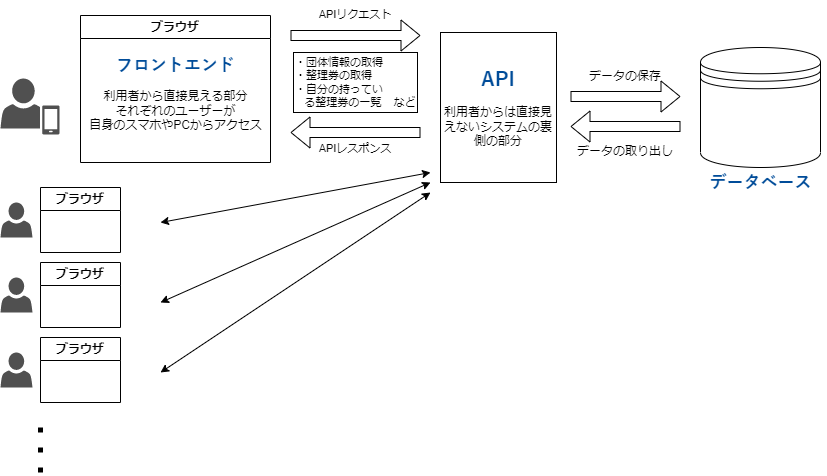

# QUAINTの構造(暫定)

## QUAINTとは【工事中】

QUIANTがどういう経緯で始まったのか等も記述する予定。  
開発者向けページである必要はないかも。  

## QUAINTの構造(暫定)

こんな感じです。  
APIのことを、フロントエンドに対比させて「バックエンド」と呼称することも一般的です。  
また、データベースの頭文字をとってDBと略すのも一般的です。  

フロントエンドはちょっと色を変えたり機能を修正したりだとかで結構更新が行われますが、APIやDBは比較的編集することが少ないです。  
(フロントエンドもその仕様変更に合わせなきゃいけないので当然と言えば当然です)

詳しくは各分野のページを見てください。

## 【工事中】

### システムの構成

#### 概要

この星陵祭オンライン整理券システムは、以下のように主に 3 つの部分から構成されます。

(ここに概要の写真)

##### フロントエンド
  - 利用者の目に見える、実際に操作する部分です。
  - インターフェイスを提供する。

##### API
  - 整理券の取得という機能を提供するためには、残り座席数などを、一元管理する必要があります。
  - それぞれの利用者自身の

##### データベース

- 実際にデータが保存される場所です。
- API を通じてデータを操作することができます。

