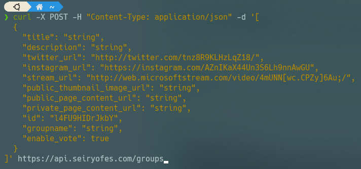
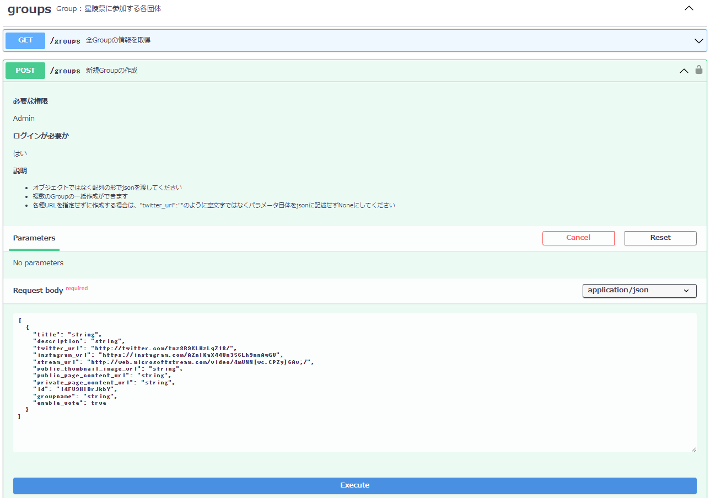

# APIドキュメント (Swagger UI)の使い方

## APIドキュメント (Swagger UI)とは
Swagger UIは、APIのテストと仕様の文書化のためのツールです。

Web APIを呼び出して実行するには本来、以下の画像のようにターミナルという黒い画面からよくわからないコマンドをたたいて...とちょっとめんどくさいのですが、

同じAPIの呼び出しがこのようにGUIで分かりやすく簡単にできます。

また複数人で開発する際には、開発者間でAPIの仕様や使い方を共有する必要があります。しかし、コンピュータ向けのAPIのプログラムを書いたうえで、さらに人間用に使い方のドキュメントも書かなければいけないのは大変ですよね。

星陵祭オンライン整理券システムで採用しているFastAPIは、ソースコードを書くと、Swagger UIのドキュメントを自動で生成してくれます！すごいですね
## APIドキュメントへのアクセス

「(APIサーバーのURL)/docs」でアクセスできます。

本番環境のAPI: [https://api.seiryofes.com/docs](https://api.seiryofes.com/docs)

検証環境のAPI: [https://api-dev.seiryofes.com/docs](https://api-dev.seiryofes.com/docs)

## 