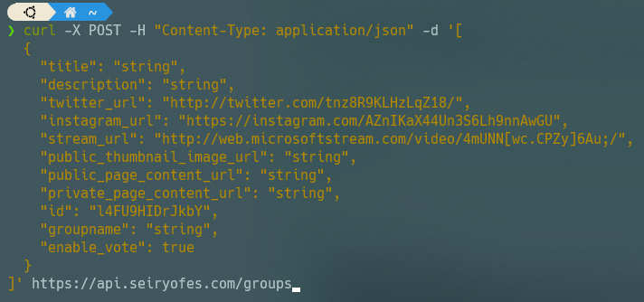
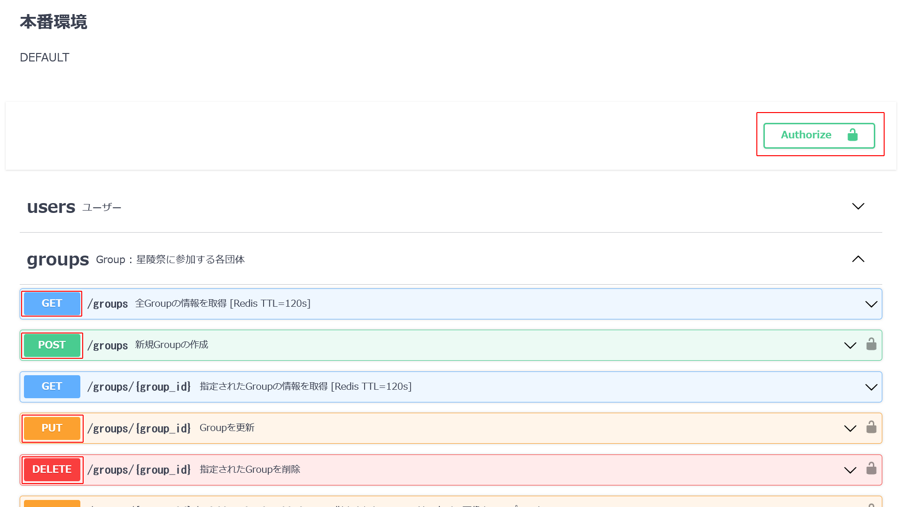
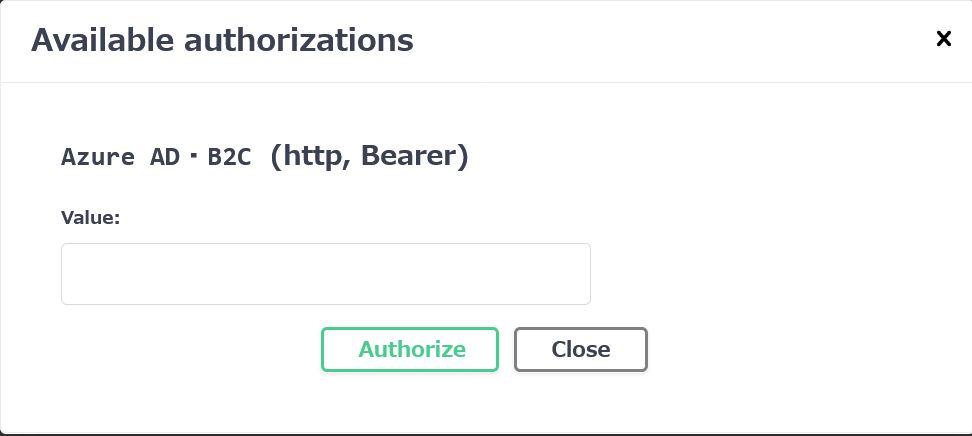
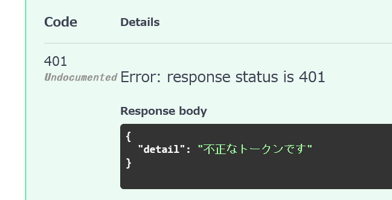
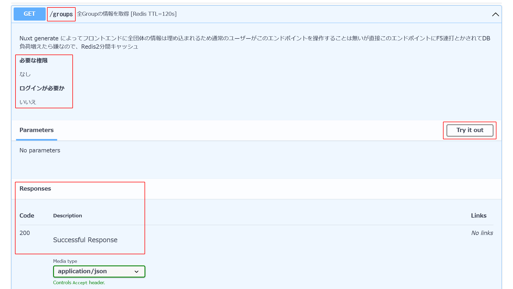
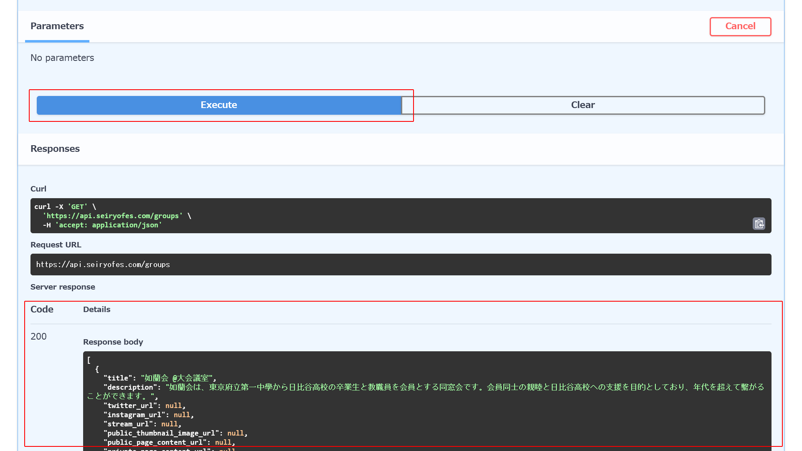
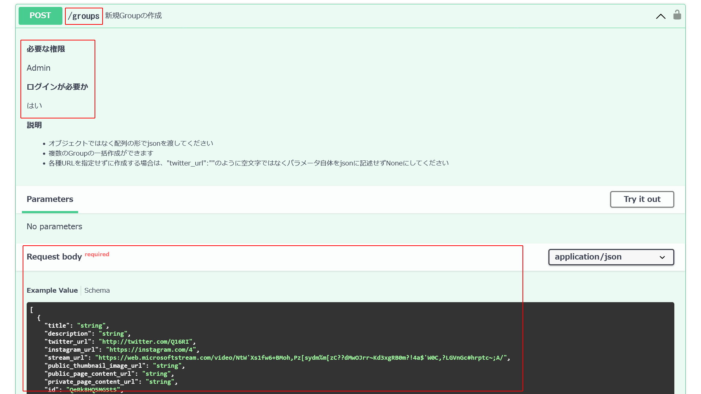
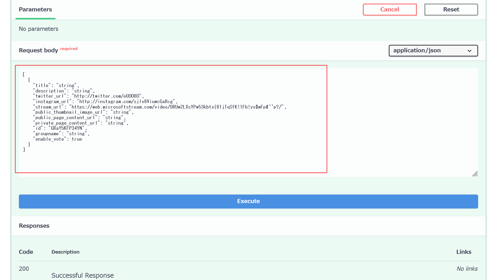

# APIドキュメント (Swagger UI)

## Swagger UIとは

Swagger UIとは、APIのテストと仕様の文書化のためのツールです。  

??? note "詳しく"
    Web APIを呼び出して実行するには本来、このように「ターミナル」という黒い画面からよくわからないコマンドをたたく必要があったのですが、

    

    同じAPIの呼び出しがこのようにGUIで分かりやすく簡単にできます。

    

    また複数人で開発する際には、開発者間でAPIの仕様や使い方を共有する必要があります。  
    しかし、コンピュータ向けのAPIのプログラムを書いたうえで、さらに人間用に使い方のドキュメントも書かなければいけないのは大変ですよね。

    ですが、星陵祭オンライン整理券システムで採用しているFastAPIは、ソースコードを書くと、Swagger UIのドキュメントを自動で生成してくれます！

## APIドキュメントへのアクセス

「(APIサーバーのURL)/docs」でアクセスできます。

本番環境：[api.seiryofes.com/docs](https://api.seiryofes.com/docs)

開発環境：[api-dev.seiryofes.com/docs](https://api-dev.seiryofes.com/docs)

## APIドキュメントの使い方

例として本番環境の画面を使います。

<h4>右上のAuthorize</h4>

認証を行います。

??? note "詳しくは"
    
    【工事中】  
    <!--
    AdminのAPIトークン
    また、開発者ツールからも調べられます。詳しくは【工事中】-->
     
    また、未認証など、必要な権限が満たされていない場合、このようなレスポンスとなります。
    

<h4>左のGETやPOST</h4>

リクエストの分類のことです。

- GET…データを取得すること
- POST…書き込み操作を行うこと(≒データを作成すること)
- PUT…更新すること
- DELETE…削除すること

 

これは、団体一覧を取得するGETメソッドのメニューです。

<h4>左上の/groups</h4>

エンドポイントです。  
Redisキャッシュについては【工事中】

<h4>必要な権限</h4>

GETメソッドには基本的に必要な権限はありません。  

<h4>Responses</h4>

結果の例が並べられています。

<h4>右のTry It Out</h4>

メソッドを実行することです。

??? note "詳しく"
    
    Executeを押すことで実行できます。  
    下にはその結果(Server response)が帰ってきます。  
    ステータスコードも同時に帰ってきます。  

  

今度は団体を追加するPOSTメソッドのメニューです。

<h4>左上の/groups</h4>

エンドポイントです。

<h4>必要な権限</h4>

この場合、Adminの人間が前述のAuthorizeを行うことで実行できるようになります。  
権限について詳しくは【工事中】

<h4>下のRequest Body</h4>

多くのPOSTメソッドは、Try It Outの際に、  
例えば「どのような団体を作成するのか」など、リクエストの内容を記述する必要があります。  

詳しくは【工事中】
