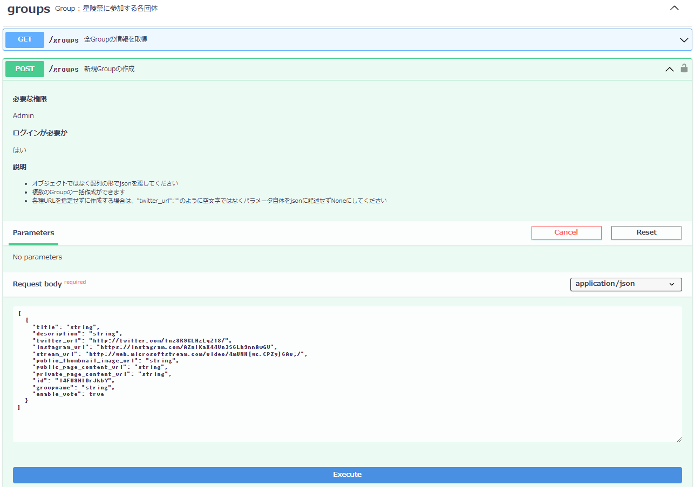

# APIドキュメント (Swagger UI)

## APIドキュメント (Swagger UI)とは(暫定)

Swagger UIとは、APIのテストと仕様の文書化のためのツールです。  

Web APIを呼び出して実行するには本来、このように「ターミナル」という黒い画面からよくわからないコマンドをたたく必要があったのですが、

同じAPIの呼び出しがこのようにGUIで分かりやすく簡単にできます。

また複数人で開発する際には、開発者間でAPIの仕様や使い方を共有する必要があります。  
しかし、コンピュータ向けのAPIのプログラムを書いたうえで、さらに人間用に使い方のドキュメントも書かなければいけないのは大変ですよね。

星陵祭オンライン整理券システムで採用しているFastAPIは、ソースコードを書くと、Swagger UIのドキュメントを自動で生成してくれます！すごいですね！！

## APIドキュメントへのアクセス

「(APIサーバーのURL)/docs」でアクセスできます。

セキュリティ的にまずい気がするのでdiscordに載せます。

## APIドキュメントの使い方(暫定)

画像付きで解説する予定です。  
暫定的に：[Swaggar UIの使い方](https://manual.nodeai.io/docs/berry/4/)

これに加えて、POSTとDELETEはAuthorizeしなければならないこと、Adminの確認方法と開発者ツールから確認する方法も記す。

