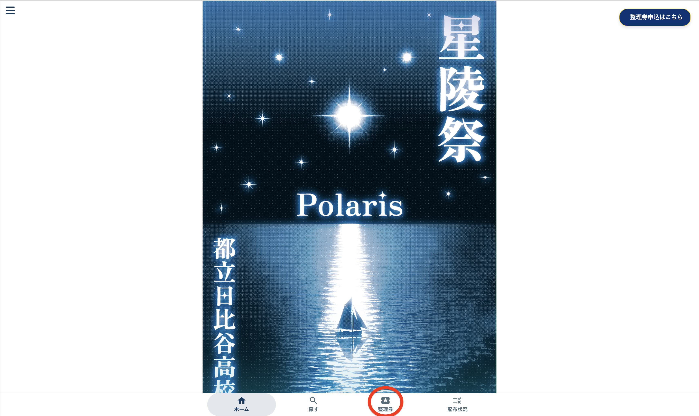
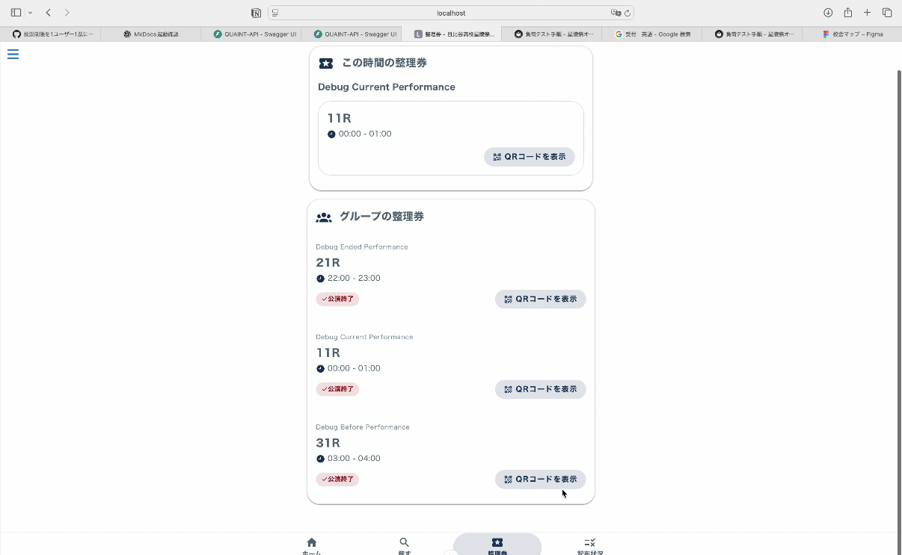
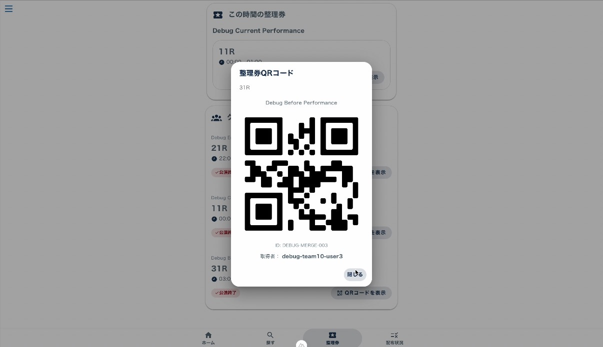

# 整理券受付

## 1.整理券表示

画面下から、「整理券」ボタンを押します。

「現在の公演」から整理券を選択し、「QRコードを表示」ボタンをクリックします。

QRコードが表示されます。
※複数人で取得している場合は、左右にスワイプするか、QRコードの下にある矢印を押すことで複数枚のQRコードを表示させることができます。

## 2.整理券キャンセル

公演開始20分前までは、整理券をキャンセルすることができます。整理券下部にあるキャンセルボタンを押してキャンセルしてください。

## 3.申し込み中の抽選
申し込み中の抽選も同じページで確認、キャンセルすることができます。  
※抽選をキャンセルする場合、どの希望をキャンセルしたいかに関わらず、その公演回第1希望から第3希望までの団体への申し込みがキャンセルされます。