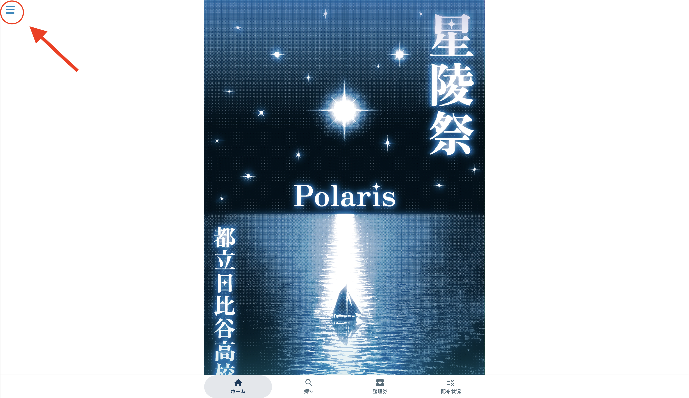
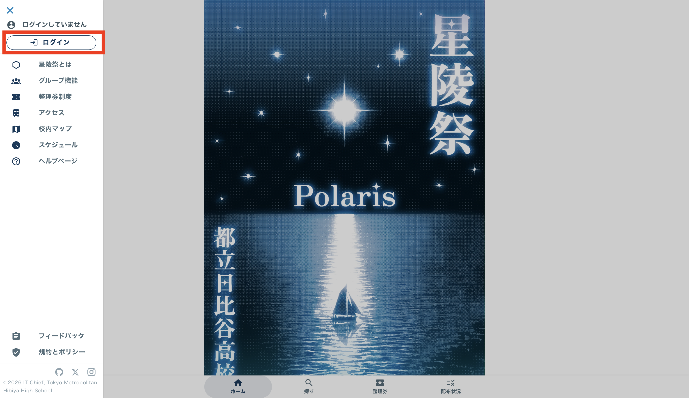
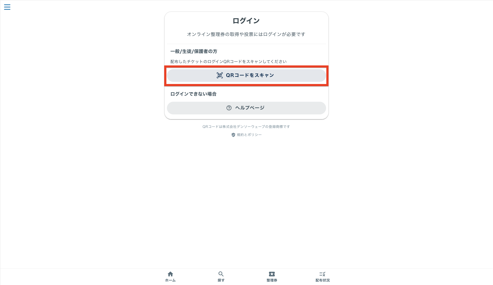
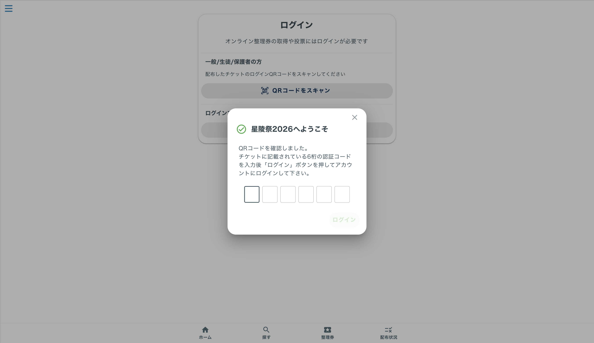
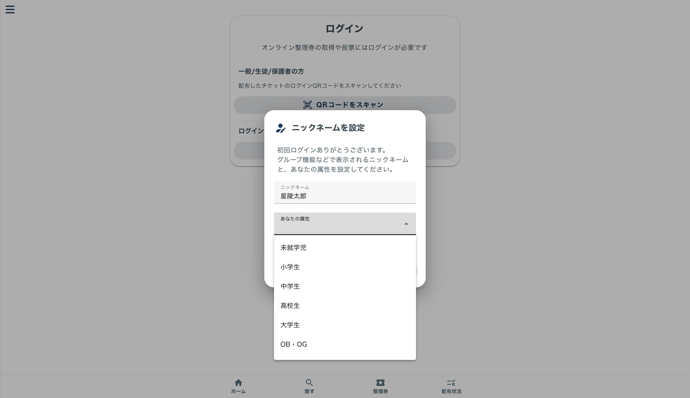
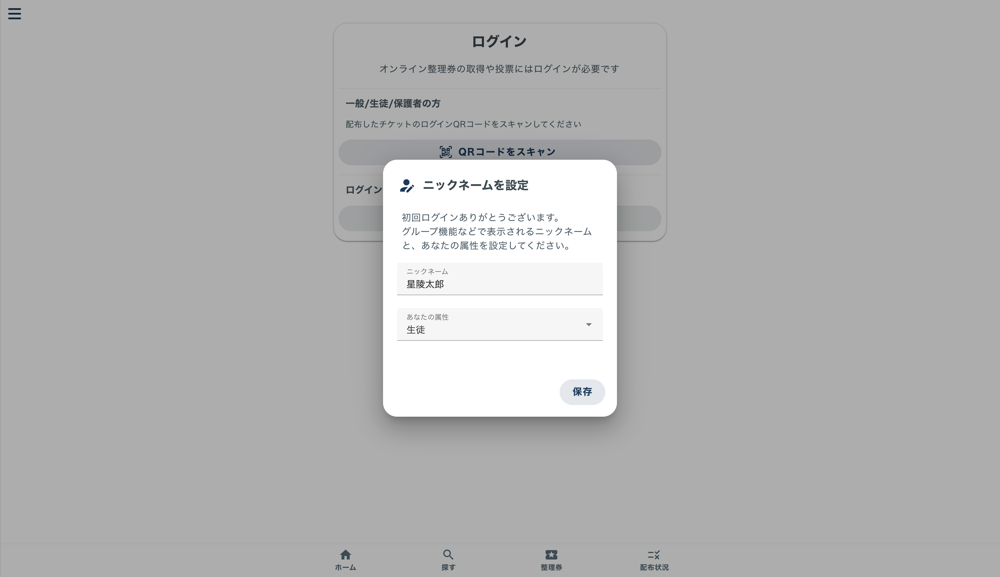

# ログイン方法

## 1.アカウント受け取り

アーケードで受付をし、1人１枚配布されるQRコードを受け取ります。

## 2.星陵祭公式サイトでログイン

[2026年度星陵祭公式サイト](https://2026.seiryofes.com)にアクセスします。

左上の三本線をクリックしてください。

「ログイン」ボタンをクリックしてください。

「QRコードをスキャン」をクリックし、受付で配布されたQRコードを読み込んでください。

表示される画面で、QRコードの下に書いてある6桁の認証コードを入力し「ログイン」ボタンをクリックしてください。

ニックネームと属性を入力し、保存ボタンをクリックしてください。  
これらは初回入力時のみ表示されます。

ログインが完了すると、「ログインに成功しました」のメッセージが表示されます。

##　注意
- QRコードを読み込むときは明るい場所で読み込んでください。暗い場所では読み込めない場合がございます。
- 配布されたQRコードはお一人様につき1枚配布しているものです。無くしたり破れたりしないようご注意ください。