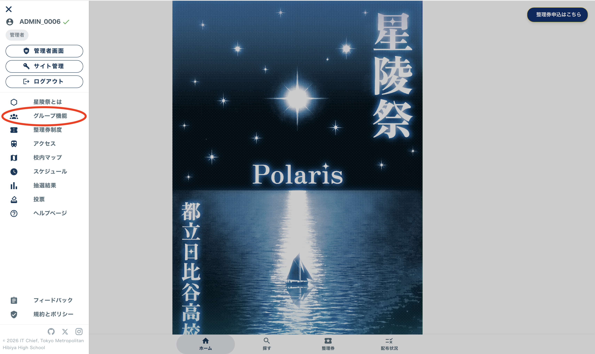
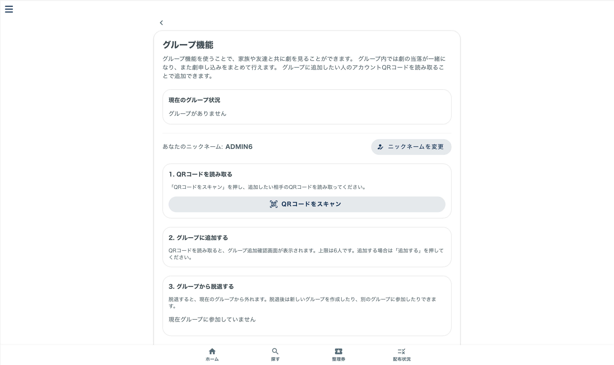
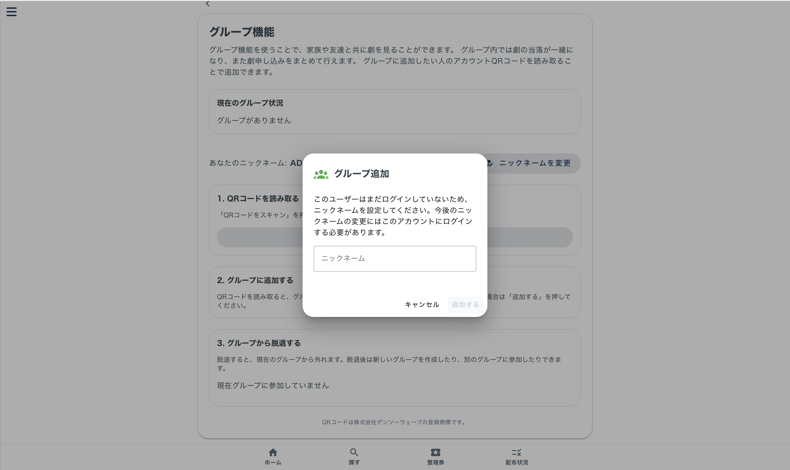
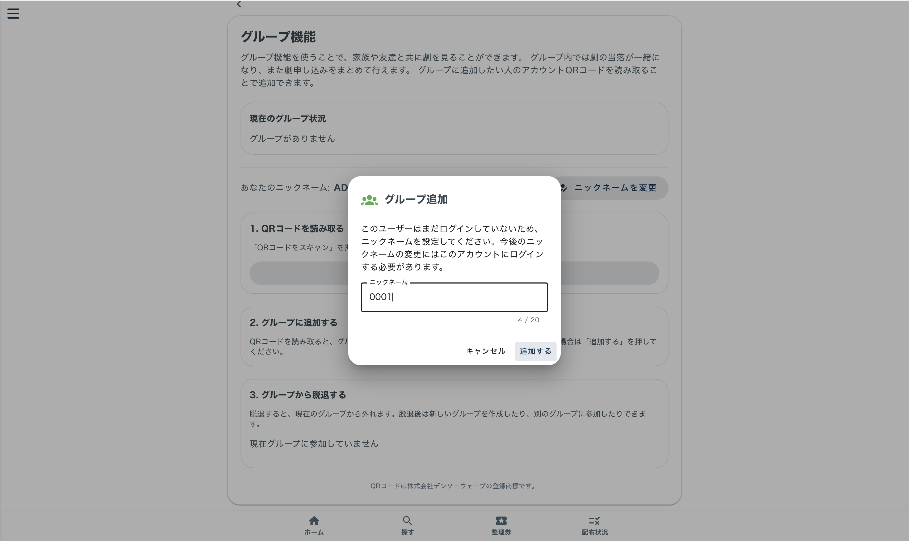
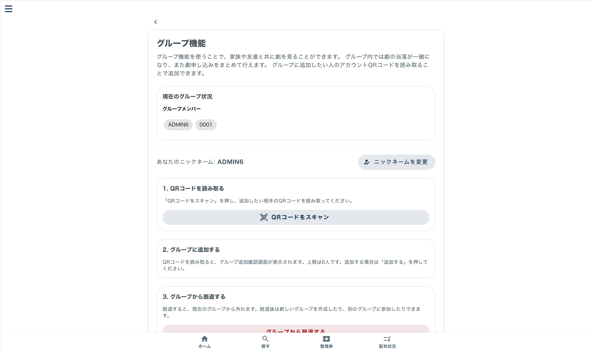
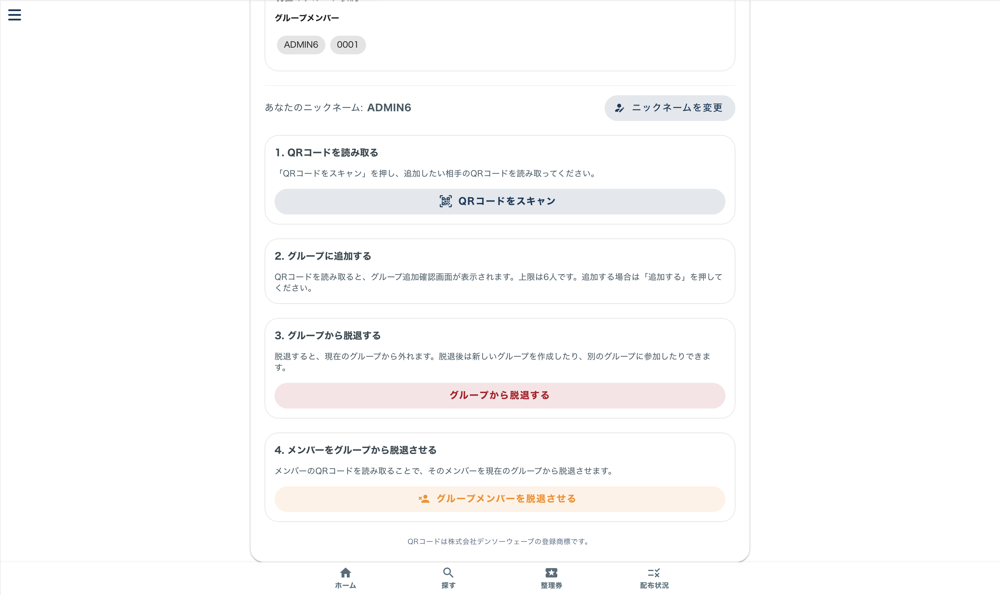
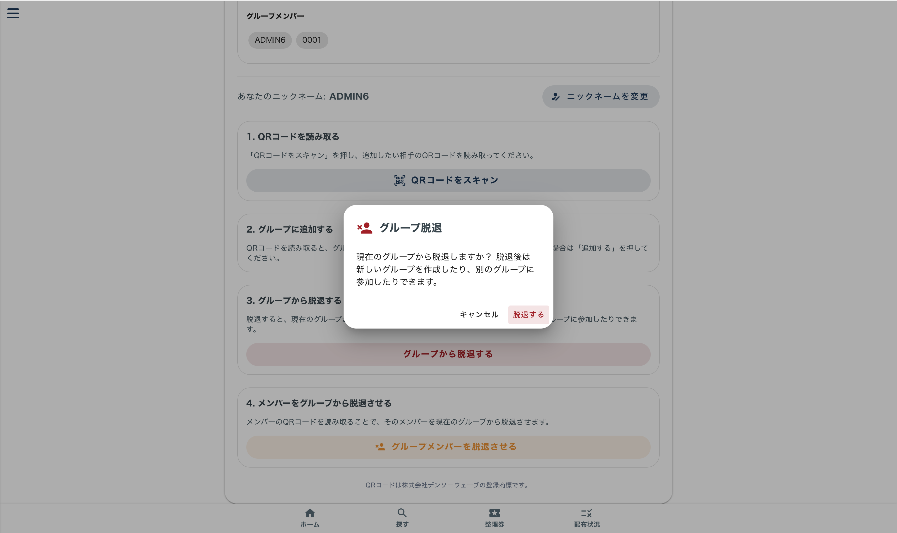

# グループ機能

## 1.グループにメンバーを追加

左上の三本線をクリックしてください。

「グループ機能」ボタンをクリックしてください。

「QRコードをスキャン」を押してください。

グループに追加したい人のアカウントのQRコードを読み取ってください。
グループに追加したい人が初回ログインの場合、以下のようにニックネームを求められます。

初回ログインの場合はニックネームを入力し、「保存する」を押します。

「現在のグループ状況」にアカウントが追加されれば成功です。

## 2.グループから脱退

「グループから脱退する」ボタンを押します。

「脱退する」ボタンを押します。

「現在のグループ状況」に「グループがありません」と表示され、脱退が成功します。

脱退後は新しくグループを作ったり、他のグループに参加したりすることができます。

## 3.メンバーをグループから脱退