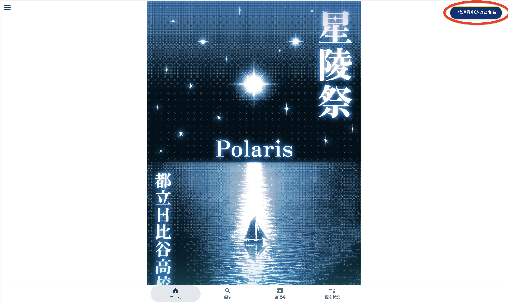
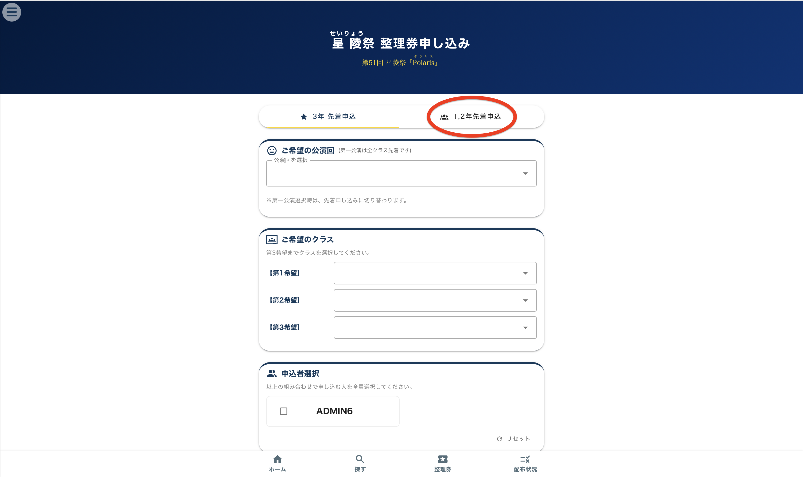
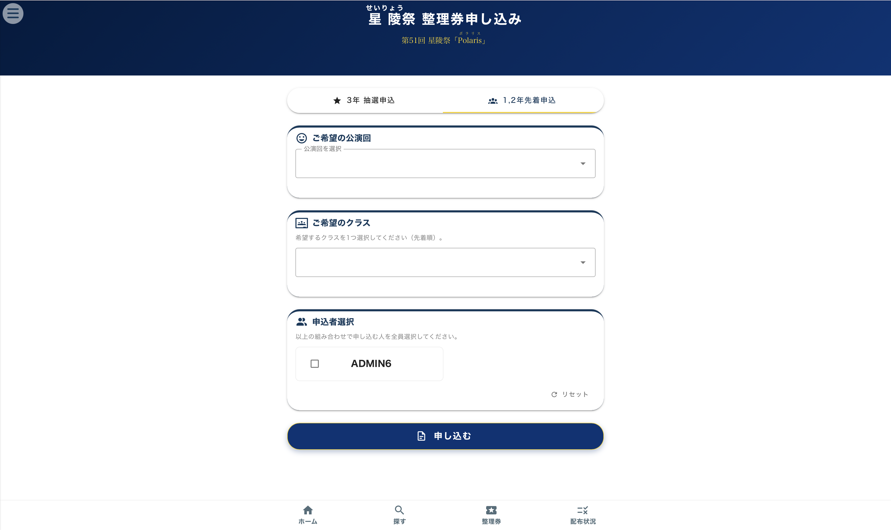

# 整理券取得

## 1.１,２年生先着申し込み

ホーム画面右上の「整理券申込はこちら」ボタンか、三本線を押した後に出てくる「整理券申込」を押してください。

上部で、「1,2年先着申し込み」を選択します。

公演回と希望するクラスを選択し、申し込む人を選んで「申し込み」ボタンを押します。

先着で整理券を取った後、50分間は整理券を取得することができません。ただし、3年生の抽選申し込みは可能です。

## 2.3年生抽選申し込み

上部で、「3年先着/抽選申し込み」を選択します。

公演回と第1希望から第3希望までのクラスを選択し、同じ組み合わせで申し込む人を選び、「申し込み」ボタンを押します。

## 3年生の抽選における注意と説明
- グループ内で、同じ公演回の同じ団体を同じ希望順位で申し込んだ人の当落は同じになります。
- グループかどうかは、抽選結果発表時に同じグループにいるかどうかで判断されます。