# 団体情報の編集
## 1. 事前準備
学校から配布されたマイクロソフトアカウントログインしていることを確認します。

左上の三本線をクリックしてください。

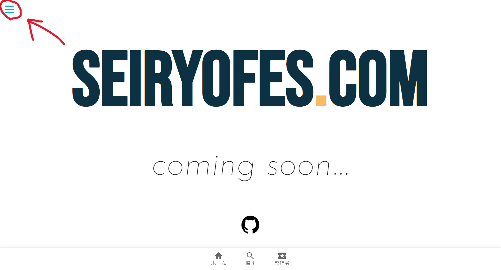

**自分の学校から配られたアカウント(~@metro.ed.jpで終わるアカウント）で入っている**こと、また自分のアカウントに**クラス代表用の権限（Owner）が与えられている**ことを確認してください。

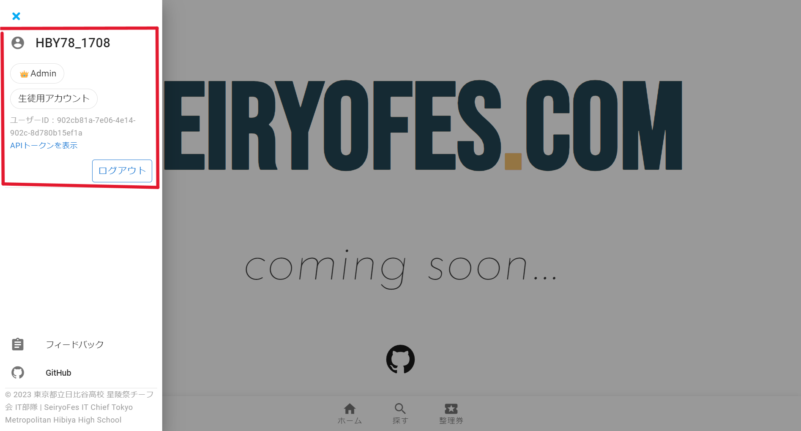

## 2. クラスのページの編集
クラスのページの編集の仕方を説明します。

クラスの劇のページを開いてください。ここでは例として11Rのページを使って説明していきます。
「団体情報を編集」というボタンが表示されているのでクリックしてください。

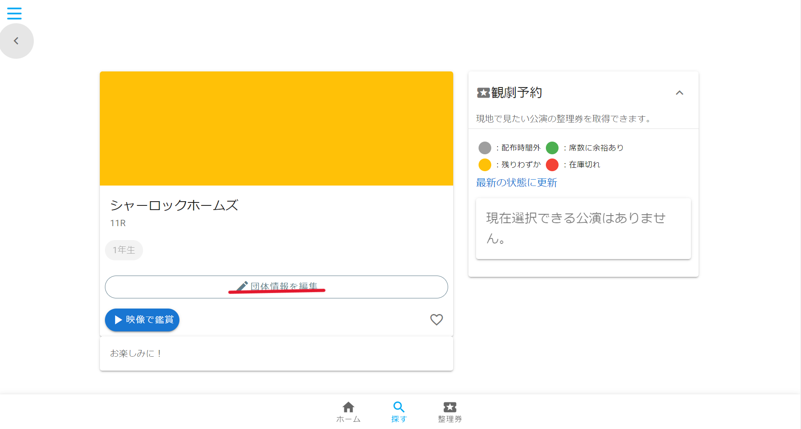

次のようなページが表示されているはずです。

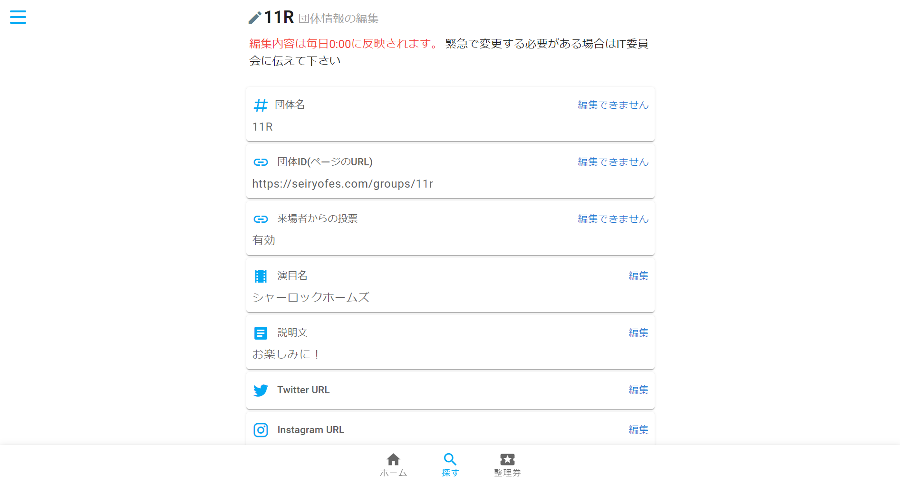

編集したい項目の横に表示されている「編集」というボタンをクリックしてください。
表示されたテキストボックスの中に表示したい内容を記述してください。
最後に下の「適用」というボタンを押してください。

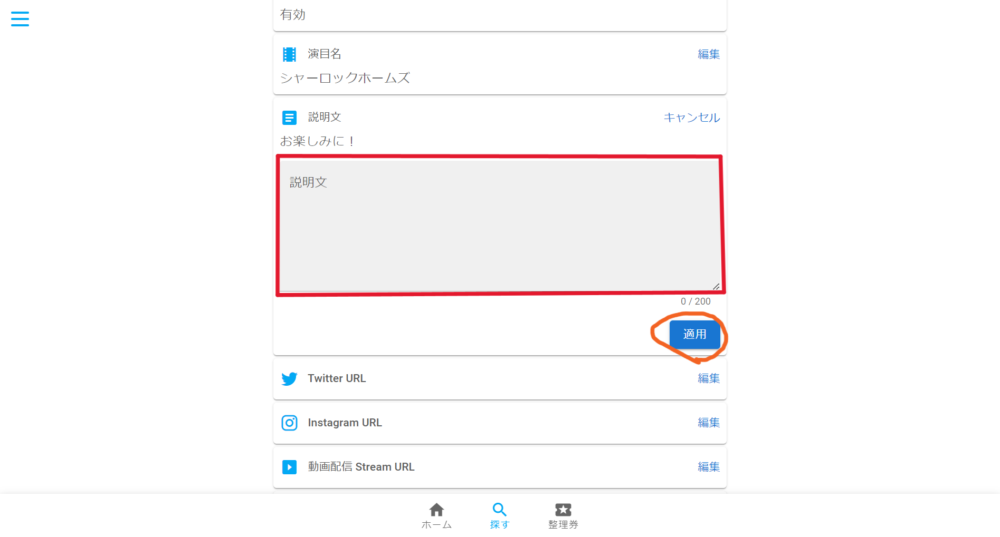

これで編集が完了です！

### ＃Twitter, Instagram, Stream URLの編集
クラスのアカウントまたStreamのページのURLを追加してください。
（例：IT委員のTwitter, Instagramのアカウント）

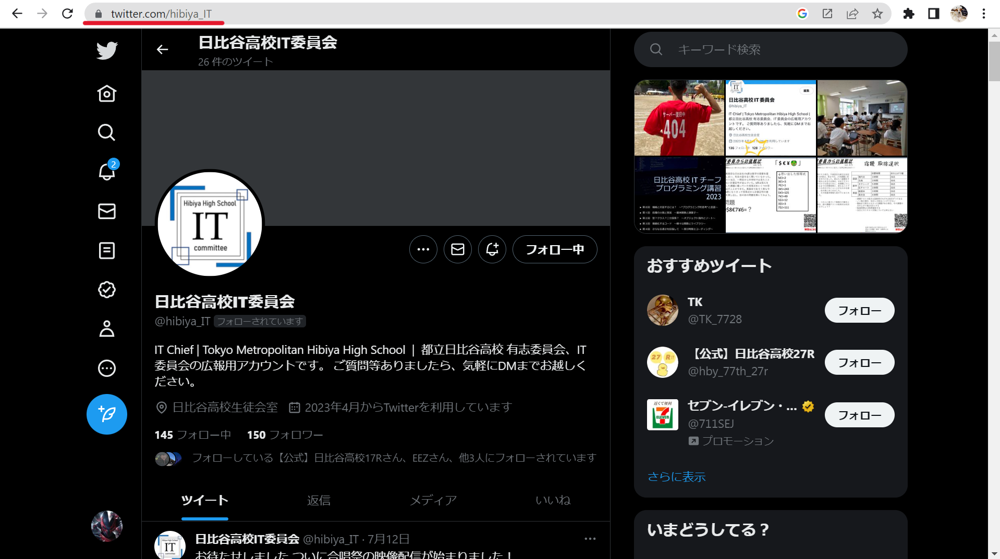

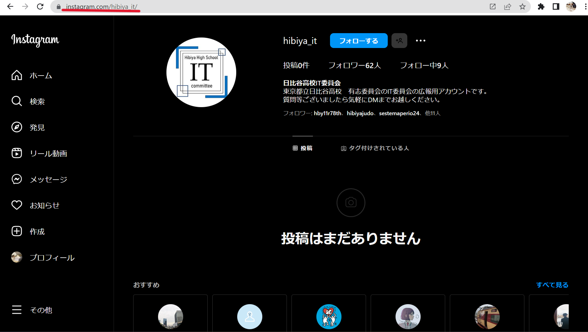

最後に「適用」ボタンを押して完了です！

### ＃サムネイル画像の編集
サムネイル画像項目の横の「編集」というボタンをクリックしてください。
「画像をアップロード」というボタンをクリックしましょう。

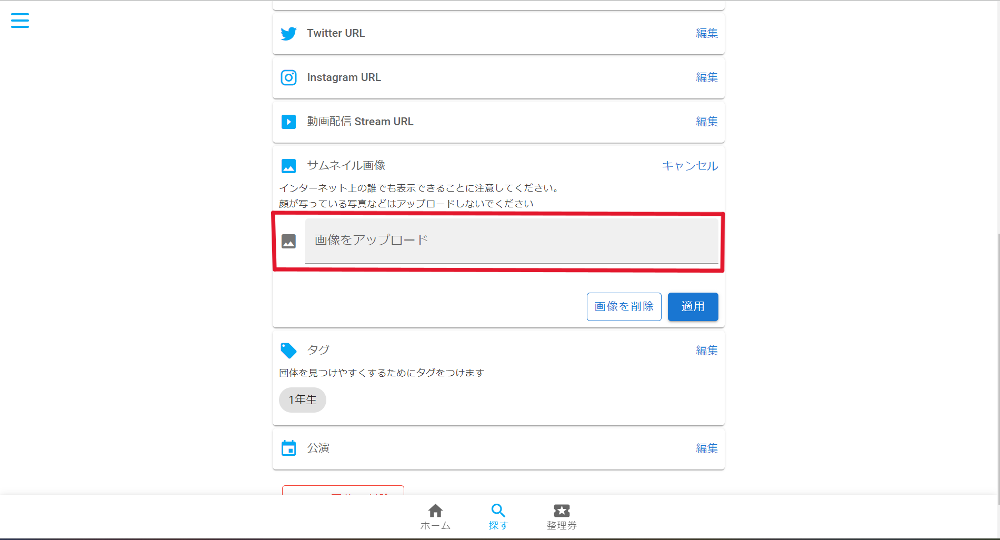

ファイルを選択する画面が立ち上がるので、アップロードする画像を選択し、右下の「開く」というボタンを押してください。

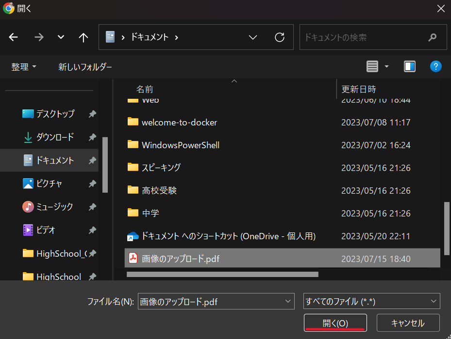

最後に右下の「適用」というボタンを押して完了です！

#### 注意
アップロードする画像のファイル形式は jpg or png にしてください。（ファイルの名前が ~.png か ~.jpg になっていることを確認してください）

### ＃タグの編集
タグ項目の横の「編集」ボタンをクリックしてください。
「タグを追加」というボタンをクリクし、追加するタグを選択してください。その後「追加」というボタンをクリックして完了です！

### ＃公演の編集
「公演名」に公演名を入力してください。

「公演の対象者を選択」ボタンをクリックし、公演の対象者を選択してください。

#### 「公演の開始時刻」、「公演の終了時刻」、「配布開始時刻」、「配布週力時刻」の設定の仕方

数字の部分（例：2023/09/17 08:30)をクリックすると青色のカーソルが表示され、数字を打つとそのカーソルの部分に反映されます。（半角英数字を使ってください）

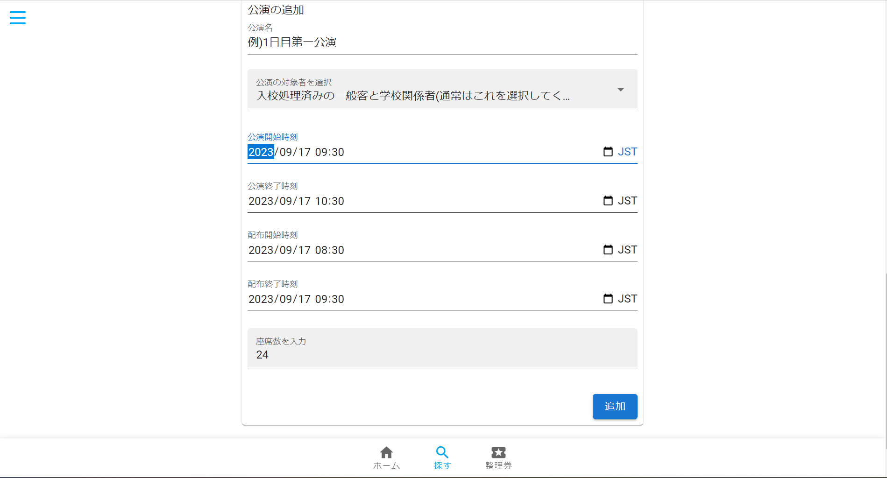

「JST」の左隣にあるカレンダーのマークをクリックするとカレンダーが表示され、日時を設定することができます。

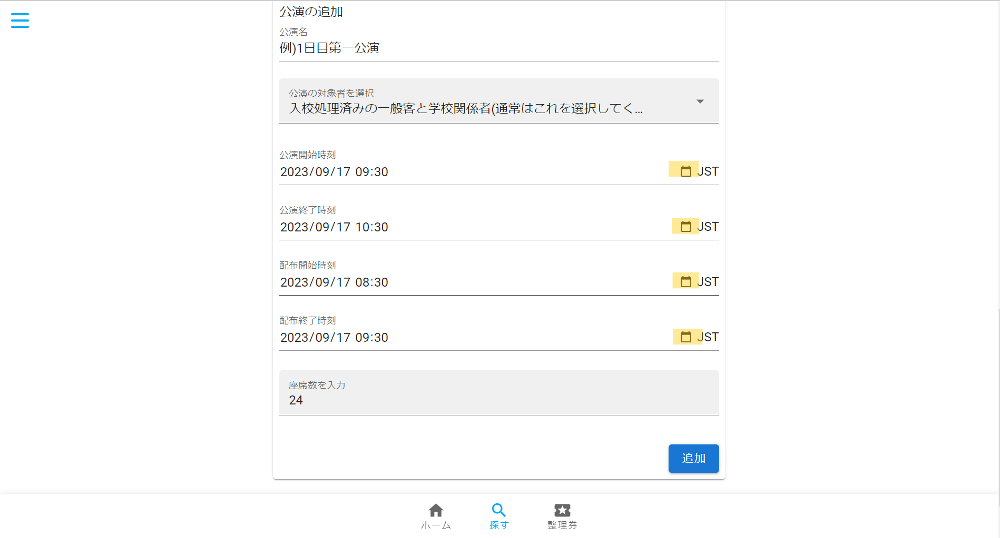

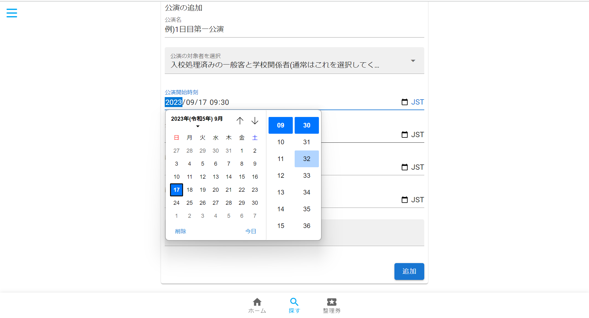

「座席数を入力」に座席数を半角英数字で入力してください。

最後に右下の「追加」ボタンを押して完了です！
