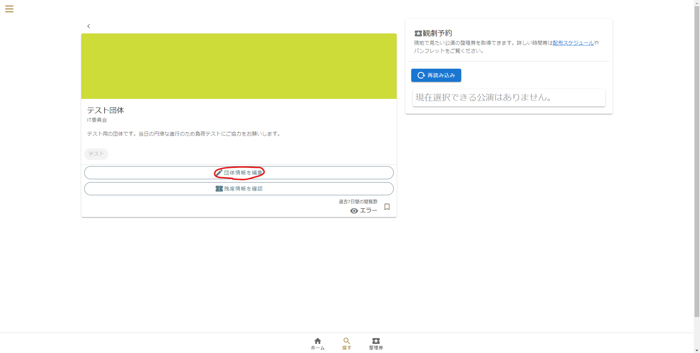
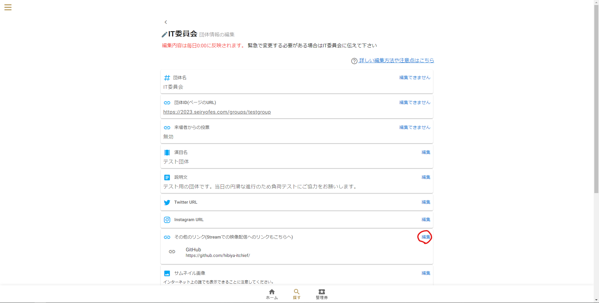
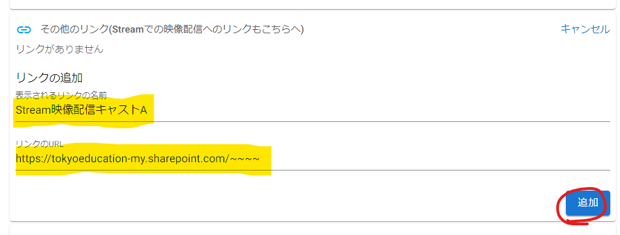
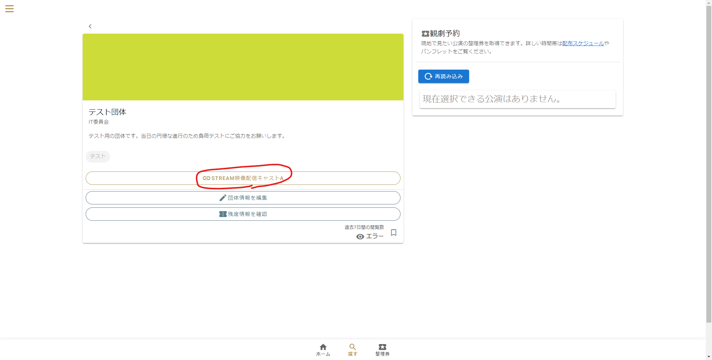

# 映像配信
## 1. 映像をMicrosoft Streamにアップロード
[こちらのPDFファイル](Stream.pdf)を参考に配信したい映像をMicrosoft Streamにアップロードしてください

Microsoft Streamにアップロードされた映像は学校から配布された「~~@metro.ed.jp」のMicrosoftアカウントでログインしないと閲覧できないことに注意してください。

保護者がオンライン整理券システムを利用するために配布されている「~~@seiryofes.com」のアカウントなどでは閲覧することはできません。

## 2. Streamへのリンクをseiryofes.comに掲載する
手順1.でコピーしたリンクを2023年度星陵祭Webサイトに掲載してアクセスしてもらいやすくしましょう.

※この手順にはクラ代や団体代表者のうち1名が持っているであろう団体代表者の権限が必要です。

### 各クラスの団体ページから「団体情報を編集」ボタンを押す
- ※このボタンが表示されない場合は団体代表者の権限が付与されていない可能性があります

### 「その他のリンク」セクションの「編集」ボタンを押す

### リンクの情報を入力
- サイトを訪問する人にわかりやすい「表示されるリンクの名前」と、配信したい動画のStreamへの「リンクのURL」を入力して「追加」ボタンを押します

### 完了!

- このように各団体のページにボタンが表示されます

## ヒント

- 「その他のリンク」にはStream以外のリンクも追加することができます
- 感想を募集するフォームなどを追加するのも良いでしょう