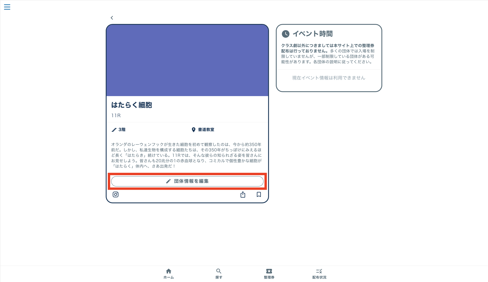
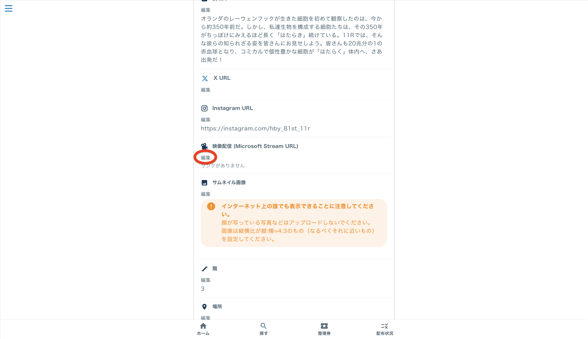
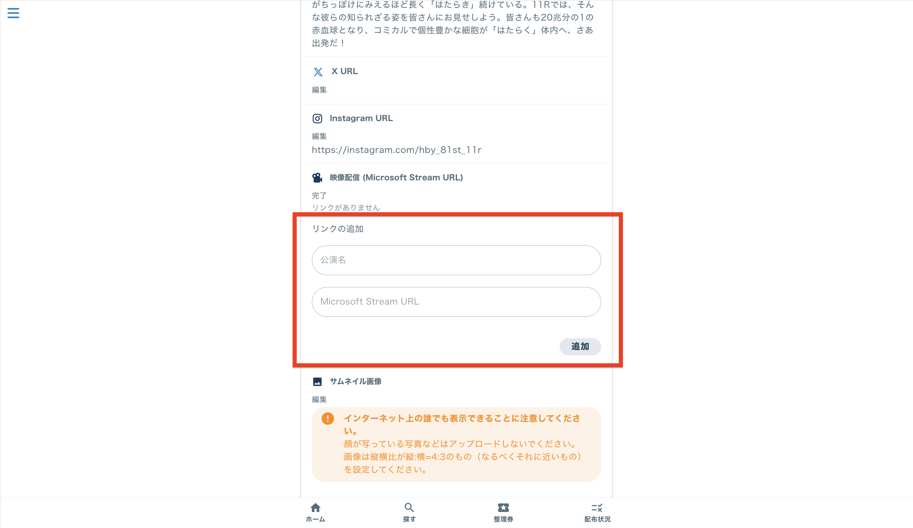

# 映像配信
## 1. 映像をMicrosoft Streamにアップロード
配信したい映像をMicrosoft Streamにアップロードしてください

Microsoft Streamにアップロードされた映像は学校から配布された「~~@metro.ed.jp」のMicrosoftアカウントでログインしないと閲覧できないことに注意してください。

## 2. Streamへのリンクをseiryofes.comに掲載する
コピーしたMicrosoft streamのリンクを[2026年度星陵祭Webサイト](https:2026.seiryofes.com)に掲載してアクセスしてもらいやすくしましょう.

※この手順にはクラ代や団体代表者のうち1名が持っているであろう団体代表者の権限が必要です。

### 各クラスの団体ページから「団体情報を編集」ボタンを押す
- ※このボタンが表示されない場合は団体代表者の権限が付与されていない可能性があります

### 「映像配信」セクションの「編集」ボタンを押す

### リンクの情報を入力
- 「公演名」と、配信したい動画のStreamへの「リンクのURL」を入力して「追加」ボタンを押します

これでリンクの追加が完了します。

## ヒント

- 「映像配信」にはStream以外のリンクも追加することができます
- 感想を募集するフォームやキャストのシフトなどのリンクを追加するのも良いでしょう