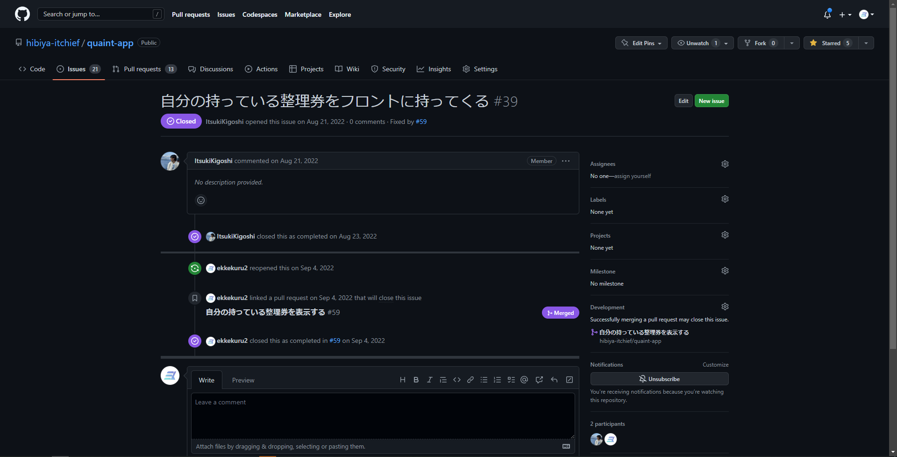

# 春休み 0 日目 環境構築

プログラミングをしてソフトウェアを開発するには、開発用のツールが必要です。文書を作るために Word を使ったり、プレゼンスライドを作るために PowerPoint を使ったりする感覚ですね。

個人的には学校指定の Surface で環境構築出来るか試してみて欲しい。自分のパソコンがある人はそれでやっても良い。

## 必要なツール

- VSCode
- Git
- WSL2 (Windows の場合)
- Docker

以下の動画を参考にインストールしてください

- [【Docker 超入門 #2】環境構築 for Windows](https://www.youtube.com/watch?v=LSQKHW01ACo)
- [【Docker 超入門 #2】環境構築 for Mac](https://www.youtube.com/watch?v=OQ5m9iEbRu0)

ほんとはもっといろんなソフトウェアを入れる必要があるんですが、VSCodeとDockerの合わせ技であるdevcontainerという技術を使うことでこれだけで済んでます。すごい

## GitHub への登録・設定

### GitHub とは

みんなでプログラムを共同開発するためのサービスです
GitHubで機能を実装する様子

アカウントを持っていない場合は[ここ](https://github.com/signup)からサインアップしてください。

アカウントが出来たら**ユーザー名を Discord で教えてください。**
