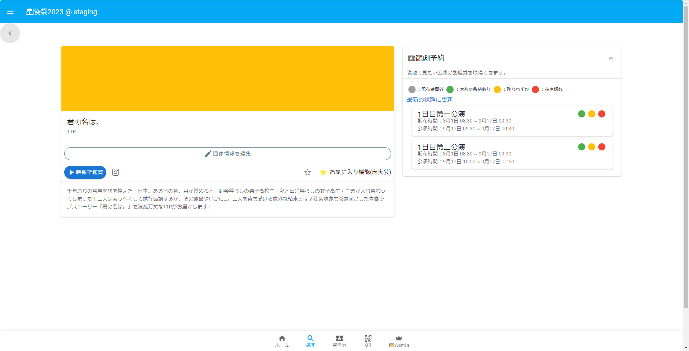
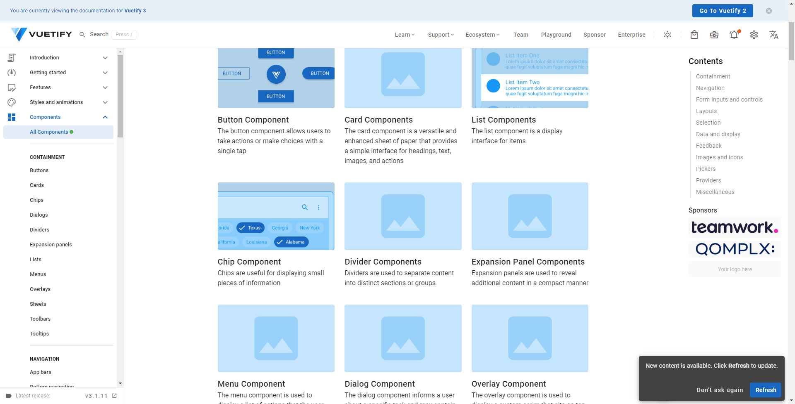

# 春休み 2 日目 Nuxt.js入門
(最終日に入門して終わり！あとは自分で頑張ってね、っていう勉強会ってどうなんだ...)
# こんな感じで書くよ
雰囲気がわかれば既存のコードのコピペをちょっと変えればだいたい書けるはず(正直俺もあまり理解できてなくてなんとなくで書いてる)

↑の画面は[こんな感じ(GitHubに飛ぶ)](https://github.com/hibiya-itchief/quaint-app/blob/develop/pages/groups/_groupId/index.vue)で書かれています

pagesというディレクトリが一番メインのディレクトリです。ここにそれぞれのページが入っています
Vue.jsというNuxt.jsがベースとしているフレームワークの書き方で書かれています
こんな感じ↓
```
<template>
// Vue.jsの書き方でUIの構造について指示する
// HTMLみたいなもの
</template>
<script>
// 動きや処理を書く
// Typescriptという言語で書きます
// このボタンが押されたら～～みたいなことをかく
</script>
<style>
// デザインを装飾
// cssという書き方で書きます
// ここは何色で！ここもうちょっと余白空けて！みたいなことをかく
</style>
```
# Vuetify
[Vuetify](https://vuetifyjs.com/)
Vuetifyとは、画面上に配置する部品たちを公開してくれているフレームワークです

ボタンとかカードとかリストとか、自分たちで1からデザインを指定して動きをつけると大変なので、統一されたデザインと動きになって公開されている部品を使います。
[https://vuetifyjs.com/en/components/all/](https://vuetifyjs.com/en/components/all/)を読んで、```<v-○○></v-○○>```とすればだいたい使えます
# ドキュメントを読もう
[https://nuxtjs.org/ja/docs/](https://nuxtjs.org/ja/docs/)
[公式のドキュメント](https://nuxtjs.org/ja/docs/)に全てが書いてあります。ただそれを読むのが結構難しい。
TODO: ドキュメントを読むのを助けるような内容をここに書く
### ルーティングとは
### ディレクトリ構成について
### ライフサイクルとは

